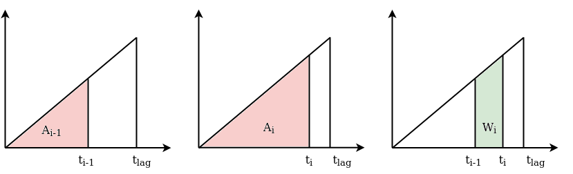

.. TODO
.. - review the conde inserted

.. note:: Last update 21/07/2021

.. .. warning:: This guide is still work in progress. New pages are being written
..              and existing ones modified. Once the guide will reach its final
..              version, this box will disappear.

.. note:: If you build your own SuperflexPy element, we would appreciate
          if you share your implementation with the community (see
          :ref:`contribute`). Please remember to update the
          :ref:`elements_list` page to make other users aware of your
          implementation.

.. _build_element:

Expand SuperflexPy: Build customized elements
=============================================

This page illustrates how to create customized elements using the SuperflexPy
framework.

The examples include three elements:

- Linear reservoir
- Half-triangular lag function
- Parameterized splitter

The customized elements presented here are relatively simple, in order to
provide a clear illustration of the programming approach. To gain a deeper
understanding of SuperflexPy functionalities, please familiarize with the code of
existing elements (importing "path" :code:`superflexpy.implementation.elements`).

.. _linear_reservoir:

Linear reservoir
----------------

This section presents the implementation of a linear reservoir element from
the generic class :code:`ODEsElement`.

.. image:: pics/build_element/reservoir.png
   :align: center

The reservoir is controlled by the following differential equation

.. math::

   \frac{\textrm{d}S}{\textrm{d}t}=P-Q

with

.. math::

   Q=kS

Note that the differential equation can be solved analytically, and (if applied) the
implicit Euler numerical approximation does not require iteration. However, we
will still use the numerical approximator offered by SuperflexPy (see
:ref:`numerical_solver`) to illustrate how to proceed in a more general case
where analytical solutions are not available.

The SuperflexPy framework provides the class :code:`ODEsElement`, which has most
of the methods required to implement the linear reservoir element. The class
implementing the reservoir will inherit from :code:`ODEsElement` and implement
only a few methods needed to specify its behavior.

.. literalinclude:: build_element_code.py
   :language: python
   :lines: 1, 3, 9, 10
   :linenos:

The first method to implement is the class initializer :code:`__init__`

.. literalinclude:: build_element_code.py
   :language: python
   :lines: 29-46
   :linenos:

In the context of SuperflexPy, the main purpose of the method :code:`__init__`
(lines 9-16) is to deal with the numerical solver. In this case we can accept two
architectures: pure Python or Numba. The
option selected will control the method used to calculate the fluxes. Note
that, since some methods of the approximator may require the Python implementation of the
fluxes, the Python implementation must be always provided.

The second method to implement is :code:`set_input`, which converts the (ordered)
list of input fluxes to a dictionary that gives a name to these fluxes.

.. literalinclude:: build_element_code.py
   :language: python
   :lines: 48, 59-60
   :linenos:

Note that the key used to identify the input flux must match the name of the
corresponding variable in the flux functions.

The third method to implement is :code:`get_output`, which runs the model and
returns the output flux.

.. literalinclude:: build_element_code.py
   :language: python
   :lines: 62, 73-77, 79-88
   :linenos:

The method receives, as input, the argument :code:`solve`: if :code:`False`, the
state array of the reservoir will not be recalculated and the outputs will be
computed based on the current state (e.g., computed in a previous run of the
reservoir). This option is needed for post-run inspection, when we want to check
the output of the reservoir without solving it again.

Line 4 transforms the states dictionary to an ordered list. Line 5 calls the
built-in ODE solver. Line 7 updates the state of the model to the last value
calculated. Lines 9-14 call the external numerical approximator to get the
values of the fluxes. Note that, for this operation, the Python implementation
of the fluxes method is always used because the vectorized operation executed
by the method :code:`get_fluxes` of the numerical approximator does not benefit
from the Numba optimization.

The last methods to implement are :code:`_fluxes_function_python` (pure Python)
and :code:`_fluxes_function_numba` (Numba optimized), which calculate the
reservoir fluxes and their derivatives.

.. literalinclude:: build_element_code.py
   :language: python
   :lines: 90-132
   :linenos:

:code:`_fluxes_function_python` and :code:`_fluxes_function_numba` are both
private static methods.

Their inputs are: the state used to compute the fluxes (:code:`S`), the initial
state (:code:`S0`), the index to use in the arrays (:code:`ind`), the input fluxes
(:code:`P`), and the parameters (:code:`k`). All inputs are arrays and :code:`ind` is
used, when solving for a single time step, to indicate the time step to look for.

The output is a tuple containing three elements:

- tuple with the computed values of the fluxes; positive sign for incoming
  fluxes (e.g. precipitation, :code:`P`), negative sign  for outgoing fluxes
  (e.g. streamflow, :code:`- k * S`);
- lower bound for the search of the state;
- upper bound for the search of the state;
- tuple with the computed values of the derivatives of fluxes w.r.t. the state :code:`S`;
  we maintain the convention of positive sign for incoming
  fluxes (e.g. derivative of the precipitation, :code:`0`), negative sign  for outgoing fluxes
  (e.g. derivative of the streamflow, :code:`- k`);

The implementation for the Numba solver differs from the pure Python implementation in two aspects:

- the usage of the Numba decorator that defines the types of input variables
  (lines 28-29)
- the method works only for a single time step and not for the vectorized
  solution. For the vectorized solution the Python implementation (with Numpy)
  is considered sufficient, and hence a Numba implementation is not pursued.

.. _build_lag:

Half-triangular lag function
----------------------------

The half-triangular lag function grows linearly until :math:`t_{\textrm{lag}}` and then drops to
zero, as shown in the schematic. The slope :math:`\alpha` is determined from the constraint that the
total area of the triangle must be equal to 1.

.. math::

    & f_{\textrm{lag}}=\alpha t & \quad \textrm{for }t\leq t_{\textrm{lag}}\\
    & f_{\textrm{lag}}=0 & \quad \textrm{for }t>t_{\textrm{lag}}

SuperflexPy provides the class :code:`LagElement` that contains most of the
functionalities needed to calculate the output of a lag function. The class
implementing a customized lag function will inherit from :code:`LagElement`, and
implement only the methods needed to compute the weight array.

.. literalinclude:: build_element_code.py
   :language: python
   :lines: 2, 136, 137
   :linenos:

The only method requiring implementation is the private method used to
calculate the :code:`weight` array.

.. literalinclude:: build_element_code.py
   :language: python
   :lines: 154-168
   :linenos:

The method :code:`_build_weight` makes use of a secondary private static method

.. literalinclude:: build_element_code.py
   :language: python
   :lines: 170-180
   :linenos:

This method returns the area :math:`A_i` of the red triangle in the figure,
which has base :math:`t_i` (:code:`bin`). The method :code:`_build_weight` uses
this function to calculate the weight array :math:`W_i`, as the difference
between :math:`A_i` and :math:`A_{i-1}`.

Note that the method :code:`_build_weight` can be implemented using other
approaches, e.g., without using auxiliary methods.

Parameterized splitter
----------------------

A splitter is an element that takes the flux from an upstream element and
distributes it to feed multiple downstream elements. The element is controlled
by parameters that define the portions of the flux that go into specific
elements.

The simple case that we consider here has a single input flux that is split
to two downstream elements. In this case, the splitter requires only one
parameter :math:`\alpha_{\textrm{split}}`. The fluxes to the downstream
elements are

.. math::

   & Q_1^{\textrm{out}} = \alpha_{\textrm{split}} Q^{\textrm{in}} \\
   & Q_2^{\textrm{out}} = \left(1-\alpha_{\textrm{split}}\right) Q^{\textrm{in}}

SuperflexPy provides the class :code:`ParameterizedElement`, which can be
extended to implement all elements that are controlled by parameters but do not
have a state. The class implementing the parameterized splitter will inherit
from :code:`ParameterizedElement` and implement only the methods required for
the new functionality.

.. literalinclude:: build_element_code.py
   :language: python
   :lines: 5, 184, 185
   :linenos:

First, we define two private attributes that specify the number of upstream and
downstream elements of the splitter. This information is used by the unit when
constructing the model structure.

.. literalinclude:: build_element_code.py
   :language: python
   :lines: 202-203
   :linenos:

We then define the method that receives the inputs, and the method that calculates
the outputs.

.. literalinclude:: build_element_code.py
   :language: python
   :lines: 205, 216-219, 235-241
   :linenos:

The two methods have the same structure as the ones implemented as part of the earlier
:ref:`linear_reservoir` example. Note that, in this case, the argument
:code:`solve` of the method :code:`get_output` is not used, but is still required to
maintain a consistent interface.
