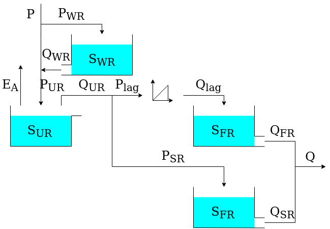
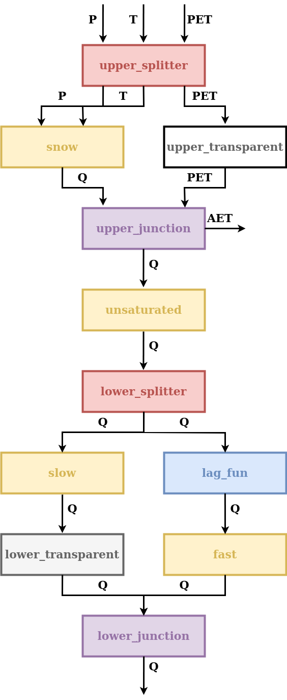
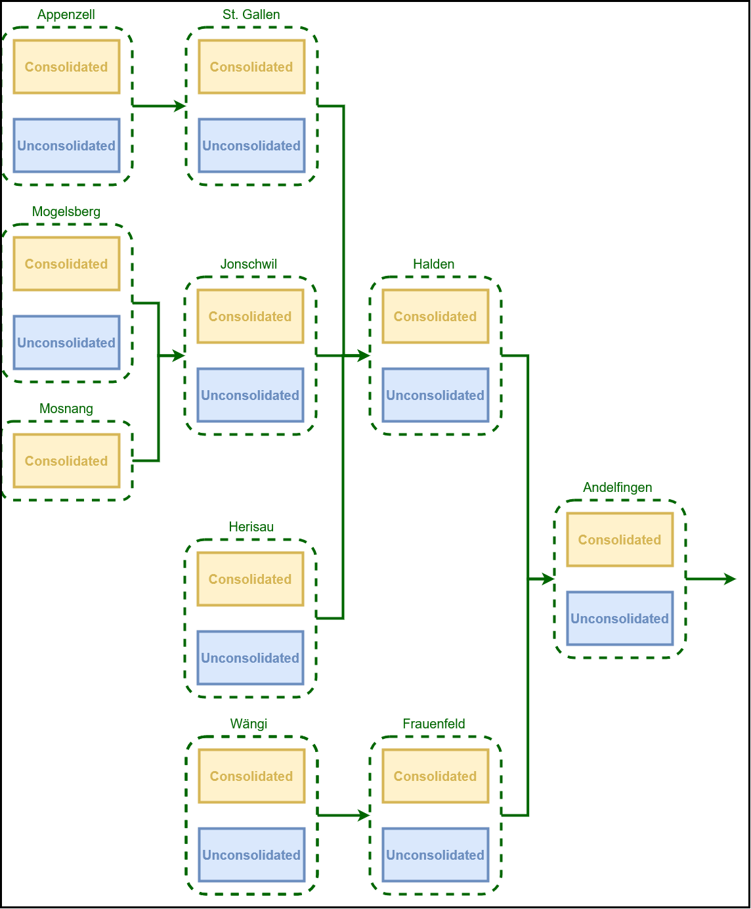

.. note:: Last update 04/05/2021

.. .. warning:: This guide is still work in progress. New pages are being written
..              and existing ones modified. Once the guide will reach its final
..              version, this box will disappear.

.. _case_studies:

Case studies
============

This page describes the model configurations used in research publications based
on Superflex and SuperflexPy.

.. _thur_case_study:

Dal Molin et al., 2020, HESS
----------------------------

This section describes the implementation of the semi-distributed hydrological
model M02 presented in the article:

   Dal Molin, M., Schirmer, M., Zappa, M., and Fenicia, F.: **Understanding**
   **dominant controls on streamflow spatial variability to set up a**
   **semi-distributed hydrological model: the case study of the Thur**
   **catchment**, Hydrol. Earth Syst. Sci., 24, 1319–1345,
   https://doi.org/10.5194/hess-24-1319-2020, 2020.

In this application, the Thur catchment is discretized into 10 subcatchments and 2
hydrological response units (HRUs). Please refer to the article for the details;
here we only show the SuperflexPy code needed to reproduce the model from the
publication.

Model structure
...............

The two HRUs are represented using the same model structure, shown in the
figure below.

This model structure is similar to :ref:`hymod`; its implementation using
SuperflexPy is presented next.

This model structure includes a snow model, and hence requires time series of
temperature as an input in addition to precipitation and PET.
Inputs are assigned to the element in the first layer of the unit and the
model structure then propagates these inputs through all the elements until they
reach the element (snow reservoir) where they are actually needed. Consequently, all the elements
upstream of the snow reservoir have to be able to handle (i.e. to input and output) that input.

In this model, the choice of temperature as input is convenient because
temperature is required by the element appearing first in the model structure.

In other cases, an alternative solution would have been to design the snow
reservoir such that the temperature is one of its state variables. This solution
would be preferable if the snow reservoir is not the first element of the
structure, given that temperature is not an input commonly used by other
elements.

The discretization of the Thur catchment into units (HRUs) and nodes
(subcatchments) is represented in the figure below.

Initializing the elements
.........................

All elements required for this model structure are already available in
SuperflexPy. Therefore they just need to be imported.

.. literalinclude:: model_thur_hess2020.py
   :language: python
   :lines: 5-6, 10, 11
   :linenos:

Elements are then initialized, defining the initial state and parameter values.

.. literalinclude:: model_thur_hess2020.py
   :language: python
   :lines: 13-15, 17-96
   :linenos:

Initializing the HRUs structure
...............................

We now define the two units that represent the HRUs.

.. literalinclude:: model_thur_hess2020.py
   :language: python
   :lines: 98-124
   :linenos:

Initializing the catchments
...........................

We now assign the units (HRUs) to the nodes (catchments).

.. literalinclude:: model_thur_hess2020.py
   :language: python
   :lines: 126-194
   :linenos:

Note that all nodes incorporate the information about their :code:`area`, which
is used by the network to calculate their contribution to the total outflow.

There is no requirement for a node to contain all units.  For example, the unit
:code:`unconsolidated` is not present in the Mosnang subcatchment. Hence, as
shown in line 50, the node :code:`mosnang` is defined to contain only the unit
:code:`consolidated`.

Initializing the network
........................

The last step consists in creating the network that connects all the nodes
previously initialized.

.. literalinclude:: model_thur_hess2020.py
   :language: python
   :lines: 196-221
   :linenos:

Running the model
.................

Before the model can be run, we need to set the input fluxes and the time step size.

The input fluxes are assigned to the individual nodes (catchments).
Here, the data is available as a Pandas DataFrame, with columns names :code:`P_name_of_the_catchment`,
:code:`T_name_of_the_catchment`, and :code:`PET_name_of_the_catchment`.

The inputs can be set using a :code:`for` loop

.. literalinclude:: model_thur_hess2020.py
   :language: python
   :lines: 253-258
   :linenos:

The model time step size is set next. This can be done directly at the
network level, which automatically sets the time step size to all lower-level
model components.

.. literalinclude:: model_thur_hess2020.py
   :language: python
   :lines: 260
   :linenos:

We can now run the model and access its output (see :ref:`demo_network` for details).

.. literalinclude:: model_thur_hess2020.py
   :language: python
   :lines: 262
   :linenos:
