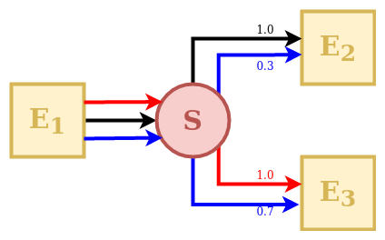
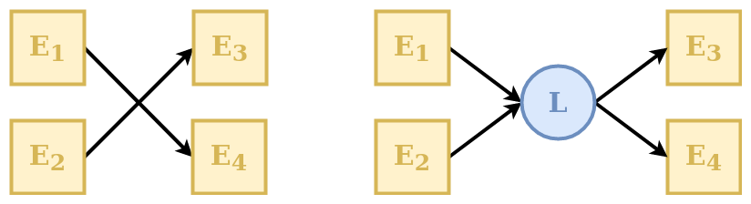
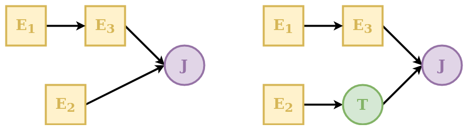
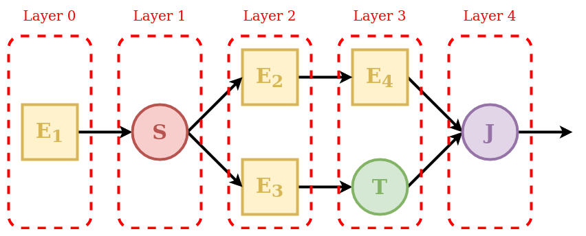
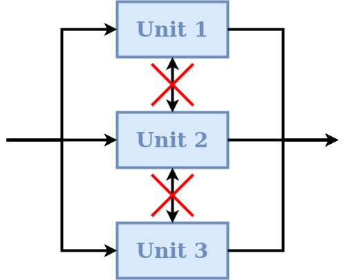
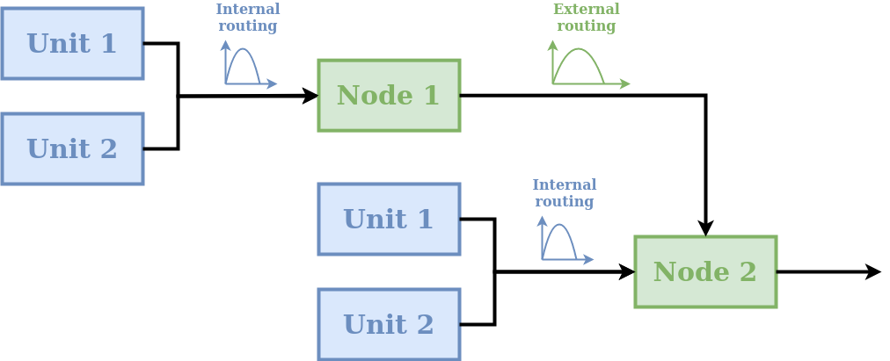
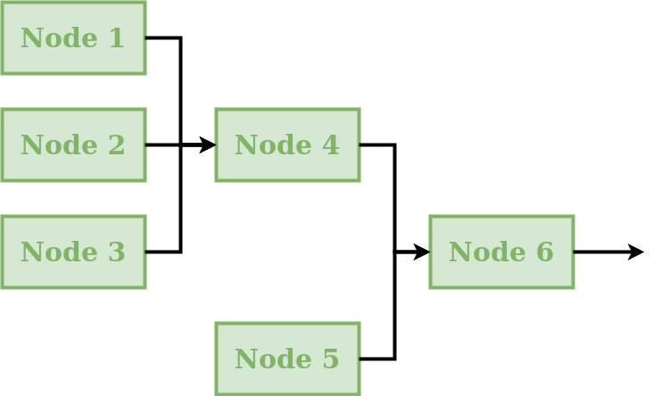

.. note:: Last update 03/05/2021

.. .. warning:: This guide is still work in progress. New pages are being written
..              and existing ones modified. Once the guide will reach its final
..              version, this box will disappear.

.. _components:

Organization of SuperflexPy
===========================

SuperflexPy is designed to operate at multiple levels of complexity, from a
single reservoir to a complex river network.

All SuperflexPy components, namely elements, units, nodes, network, are designed
to operate alone or as part of other components. For this reason, all components
have methods that enable the execution of basic functionality (e.g. parameter
handling) at all levels. For example, consider a unit that contains multiple
elements. The unit will then provide the functionality for setting the parameter
values for its elements.

Note that, programmatically, SuperflexPy component types are classes, and the
actual model components are then class instances (objects).

We will first describe each component type in specific detail, and then
highlight some :ref:`generalities` that apply to all components.

Elements
--------

Elements represent the basic level of the SuperflexPy. Conceptually, SuperflexPy
uses the following elements: reservoirs, lag functions, and connections.
Elements can be used to represent a complete model structure, or combined
together to form one or more :ref:`unit`.

Depending on their type, conceptual elements can have parameters and/or states,
can handle multiple fluxes as inputs and/or as outputs, can be designed to
operate with one or more elements upstream or downstream, can be controlled by
differential equations or by a convolution operations, etc.

Programmatically, the conceptual elements can be implemented by extending the
following classes:

- :code:`BaseElement`: for elements without states and parameters (e.g.,
  junctions);

- :code:`StateElement`: for elements with states but without parameters;

- :code:`ParameterizedElement`: for elements with parameters but without states
  (e.g., junctions);

- :code:`StateParameterizedElement`: for elements with states and parameters
  (e.g., reservoirs and lag functions).

For example, consider the conceptual element "junction", which sums the fluxes coming
from multiple elements upstream without needing states or parameters. This element can be
built by extending the class :code:`BaseElement` to implement the method that
sums the fluxes.

To facilitate usage, SuperflexPy provides a set of "pre-packaged" classes that
already implement already most of the functionality needed to specify
reservoirs, lag functions, and connections. The next sections focus on these
classes.

.. _reservoirs:

Reservoirs
**********

A reservoir is a storage element described by the differential equation (or,
more generally, a system of differential equations)

.. math::
   \frac{\textrm{d}\mathbf{S}}{\textrm{d}t}=\mathbf{I}(\mathbf{\theta}, t)-\mathbf{O}(\mathbf{S}, \mathbf{\theta}, t)

where :math:`\mathbf{S}` represents the internal states of the reservoir,
:math:`\mathbf{I}` represents the sum of all input fluxes, :math:`\mathbf{O}` represents the sum of all output fluxes,
and :math:`\mathbf{\theta}` represents the parameters that control the behavior
of the reservoir. In most conceptual models, reservoir elements have a single
state variable (representing water storage), however multiple state variables can
be accommodated when necessary (e.g., to represent transport).

SuperflexPy provides the class :code:`ODEsElement` that contains all the logic
needed to represent an element controlled by a differential equation. The user needs
only to specify the equations defining input and output fluxes.

The differential equation is solved numerically, though analytical solutions
could be possible. The choice of solution method
(e.g. the implicit Euler scheme) is made by the user when initializing the
reservoir element.

SuperflexPy provides several "numerical approximators" to solve decoupled ODEs,
including the implicit and the explicit Euler schemes. The user can either
employ the numerical routines provided by the framework, or implement the
interface necessary to use an external solver (e.g. from :code:`scipy`), which
may be needed when the numerical problem becomes more complex (e.g. coupled
differential equations). For more information about the numerical solver refer
to the page :ref:`numerical_solver`.

Lag functions
*************

A lag function is an element that applies a delay to the incoming fluxes. In
mathematical terms, the lag function represents a convolution of the incoming
fluxes with a weight function. Here, the convolution is implemented by distributing the fluxes at a
given time step into the subsequent time steps, according to a weight array.
The same procedure is then repeated over multiple time steps, adding together
the contributions originating from the preceding time steps.

SuperflexPy provides the class :code:`LagElement` that implements all the
methods needed to represent a lag function. The user only needs to define the
weight array.

.. _connections:

Connections
***********

Connection elements are used to link together multiple elements when building a
unit.

SuperflexPy provides several types of connection elements. For example, a
:code:`Splitter` is used to split the output flux from a single upstream element
and distribute the respective portions to multiple downstream elements.
Conversely, a :code:`Junction` is used to collect the output fluxes from
multiple upstream elements and feed them into a single downstream element.
Connection elements are designed to operate with an arbitrarily number of fluxes
and upstream/downstream elements.

Splitter
........

A :code:`Splitter` is an element that receives the outputs of a single upstream
element and distributes them to several downstream elements.

The behavior of a splitter in SuperflexPy is controlled by two matrices:
"direction" and "weight". The direction matrix specifies *which* input fluxes
contribute (even fractionally) to the downstream elements and in which order.
The weight matrix defines the *proportion* of each of the input fluxes that goes into
each the downstream element.

In the illustration schematic, element S receives 3 input fluxes, which are coloured
and indexed according to their order: red (index 0), black (index 1), and blue
(index 2). Element E2 receives the black flux as its first input (index 0), the
blue flux as its second input (index 1), and does not receive any portion of the
third flux. Element E3 receives the blue flux as its first input (index 0), the red
flux as its second input (index 1), and does not receive any portion of the black
flux.

This information is represented by the direction matrix :math:`\mathbf{D}` as
follows:

.. math::
   \mathbf{D}=
   \begin{pmatrix}
   1 & 2 & \textrm{None}\\
   2 & 0 & \textrm{None}
   \end{pmatrix}

The direction matrix is a 2D matrix with as many columns as the number of fluxes
and as many rows as the number of downstream elements. The row index refers to a
downstream element (in this case the first row refers to element E2, and the
second row to element E3). The column index refers to the input fluxes received
by to the downstream element. Note that care must be taken when indexing the
elements and fluxes to correctly reflect the intended model structure.

The values of :math:`\mathbf{D}` can be an integer referring to the index of the
input flux to the splitter S, or :code:`None` if an input flux to the splitter S
does not reach a downstream element.

As such, the direction matrix can be used to select the fluxes and change the
order in which they are transmitted to downstream elements.

Next, we consider the weight matrix :math:`\mathbf{W}`, which describes the fraction of each flux
directed to each downstream element. The red flux is taken entirely by element
E3, the black flux is taken entirely by element E2, and the blue flux is split
at 30% to E2 and 70% to E3. This information is represented as follows:

.. math::
   \mathbf{W}=
   \begin{pmatrix}
   0 & 1.0 & 0.3\\
   1.0 & 0 & 0.7
   \end{pmatrix}

The weight matrix has the same shape as the direction matrix. The row
index refers to the downstream element, in the same order as in the direction
matrix :math:`\mathbf{D}`, whereas the column index refers to the input flux to
the splitter S.

The elements of :math:`\mathbf{W}` represent the fraction of each input flux
received by the splitter S and directed to the downstream element. In the
example, the first downstream element (first row of the matrix :math:`\mathbf{W}`) receives 0% of
the first (red) flux, 100% of the second (black) flux, and 30% of the third
(blue) flux.

Note that the columns of the weight matrix should sum up to 1
to ensure conservation of mass.

Junction
........

.. image:: pics/components/junction.png
   :align: center

A :code:`Junction` is an element that receives the outputs of several upstream
elements and directs them into a single downstream element.

The behavior of a junction in SuperflexPy is controlled by a direction matrix, which
defines how the incoming fluxes are to be combined (summed) to feed the
downstream element.

In the schematic, element E3 receives 3 input fluxes, which are indexed based
on their order: red (index 0), black (index 1), and blue (index 2). The red flux
comes from both upstream elements (index 0 and 1, respectively); the black flux
comes only from element E1 (index 1); the blue flux comes only from element E2
(index 0). This information is represented by the direction matrix
:math:`\mathbf{D}` as follows:

.. math::
   \mathbf{D}=
   \begin{pmatrix}
   0 & 1\\
   1 & \textrm{None}\\
   \textrm{None} & 0
   \end{pmatrix}

The direction matrix is a 2D matrix that has as many rows as the number of
fluxes and as many columns as number of upstream elements. The row index refers
to the flux (in this case the first row refers to the red flux, the second row
to the black flux, and the third row to the blue flux). The column index refers
to the upstream element input flux to the junction (in this case the first
column refers to element E1, the second column to element E2).

The value of the matrix element can be an integer referring to the index of the
input flux to junction J coming from the specific upstream element, or
:code:`None` if an input flux to junction J does not come from the upstream element.

Linker
......

A :code:`Linker` is an element that can be used to connect multiple elements
upstream to multiple elements downstream without mixing fluxes.

Linkers are useful in SuperflexPy because the structure of the unit is defined
as an ordered list of elements (see :ref:`unit`). This means that if we want to connect the first
element of a layer to the second element of the following layer (e.g., direct
the output from upstream element E1 to downstream element E4, in the example
above) we have to insert an additional intermediate layer with a linker that
directs the fluxes to the correct downstream element. Further details on the
organization of the units in layers are presented in section :ref:`unit`.

Transparent
...........

A transparent element is an element that returns, as output, the same fluxes
that it receives as input. This element is needed to fill "gaps" in the structure
defining a unit. See :ref:`unit` for further details. An example is shown in
the schematic above where the transparent element is used
to make the two rows have the same number of elements.

.. _unit:

Unit
----

A unit is a collection of multiple connected elements. The unit can be used
either alone, when intended to represent a lumped catchment model, or as part
of a :ref:`components_node`, to create a semi-distributed model.

As shown in the schematic, elements are organized as a succession of layers,
from left (upstream) to right (downstream).

The first and last layers must contain only a single element, since the
inputs of the unit are "given" to the first element and the outputs of the unit
are "taken" from the last element.

The order of elements inside each layer defines how they are connected: the
first element of a layer (e.g. element E2 in the schematic) will transfer its outputs to
the first element of the downstream layer (e.g. element E4); the second element of a
layer (e.g. element E3) will transfer its outputs to the second element of the
downstream layer (e.g. element T), and so on.

When the output of an element is split between multiple downstream elements
an additional
intermediate layer with a splitter is needed. For example, element E1 is
intended to provide its outputs to elements E2 and E3. In this case the splitter S has
two downstream elements (E2 and E3); the framework will route the first group of
outputs of the splitter to element E2 and the second group of outputs to element E3.

Whenever there is a "gap" in the structure, a transparent element should be used
to fill the gap. In the example, the output of element E3 is combined with the output
of element E4. Since these elements belong to different layers, making this connection
directly would create a gap in Layer 3. This problem is solved by specifying a
transparent element in Layer 3, i.e., in the same layer as element E4.

Finally, since the unit must have a single element in its last layer, the
outputs of elements E4 and T must be collected using the junction J.

Each element is aware of its expected number of upstream and downstream
elements. For example, a reservoir must have a single upstream element and a
single downstream element, a splitter must have a single upstream element and
potentially multiple downstream elements, and so on. A unit is valid only if all
layers connect to each other using the expected number of elements. In the
example, Layer 1 must have two downstream elements that is consistent with the
configuration of Layer 2.

Elements are *copied* into the unit. This means that an element that belongs to
a unit is completely independent from the originally defined element and from
any other copy of the same element in other units. This SuperflexPy design
choice ensures that changes to the state or to the parameters of an element
within a given unit will not affect any element outside of that unit. The code
below illustrates this behavior:

.. literalinclude:: components_code.py
   :language: python
   :lines: 1-8
   :linenos:

In the code, element :code:`e1` is included in units :code:`u1` and :code:`u2`.
In lines 6-8 the value of parameter :code:`p1` of element :code:`e1` is changed
at the element level and at the unit level. Since elements are *copied* into a
unit, these changes apply to three different elements (in the sense of different
Python objects in memory), the "originally defined" :code:`e1` and the copies of
:code:`e1` in :code:`u1` and :code:`u2`.

For more information on how to define a unit structure in SuperflexPy, refer to
the page :ref:`popular_models`, where the framework is used to reproduce some
existing lumped models.

.. _components_node:

Node
----

A node is a collection of multiple units assumed to operate in parallel. In the
context of semi-distributed models, a node represents a single catchment and
the units represent multiple landscape elements (areas) within the catchment.
A node can be run either alone or as part of a bigger
:ref:`components_network`.

The default behavior of nodes is that parameters are *shared* between
elements of the same unit, even if that unit belongs to multiple nodes. This
SuperflexPy design choice is motivated by the unit being intended to represent
areas that have the same hydrological response. The idea is that the
hydrological response is controlled by the parameters, and therefore elements of
the same unit (e.g. HRU) belonging to multiple nodes should have the *same*
parameter values.

On the other hand, each node has its own states that are tracked separately
from the states of other nodes. In particular, when multiple nodes that share
the same parameter values receive different inputs (e.g., rainfall), their
states will evolve differently. This SuperflexPy design choice supports the most common use of nodes, which is
the discretisation of a catchment into potentially overlapping HRUs and
subcatchments. Parameters are then assumed constant within HRUs (units), and
inputs are assumed to be constant within subcatchments (nodes).

In term of SuperflexPy code, this behavior is achieved by (1) copying the
states of the elements belonging to the unit when this unit becomes part of a
node; (2) sharing, rather than copying, the parameter values. This means that
changes to the parameter values of an element within a node will affect the
parameter values of that elements of all other nodes that share the same unit.
In contrast, changes to the states will be node-specific.

This default behavior can be changed by setting :code:`shared_parameters=False`
at the initialization of the node. In this case, all parameters become
node-specific, with no sharing of parameter values even within the same unit.

Refer to the section :ref:`demo_mult_nodes` for details on how to incorporate
units into nodes.

Routing
*******

A node can include routing functions that delay the fluxes. As shown in the
schematic, two types of routing are possible:

- internal routing;

- external routing.

A typical usage of these routing functions in semi-distributed hydrological
modelling is as follows. Internal routing is used to represent delays associated
with the routing of fluxes across the catchment towards the river network.
External routing is used to represent delays associated with the routing of
fluxes within the river network, i.e., from the outlets of the given node to the
inlet of the downstream node.

More generally, routing functions can be used for representing any type of delay
between the units and the node, as well as delays between nodes.

In the default implementation of a node in SuperflexPy, the two routing
functions simply return their input (i.e. no delay is applied). The user can
implement a different behavior, e.g., see section
:ref:`routing_node`.

.. _components_network:

Network
-------

A network connects multiple nodes into a tree structure, and is typically
intended to develop a distributed model that generates predictions at internal
subcatchment locations (e.g. to represent a "nested" catchment setup).

The connectivity of the network is defined by assigning to each node the
information about its downstream node. The network will then compute the node
output fluxes, starting from the inlets and then moving downstream, calculating
the outflows of the remaining nodes and routing the fluxes towards the outlet.

The network is the only component of SuperflexPy that does not have the
:code:`set_input` method (see :ref:`generalities`), because inputs are assumed
to be node-specific and hence have to be assigned to each node within the
network.

A node is *inserted* (rather than *copied*) into the network. In other words, we
initialize a node object and then insert it into the network. This node can then
be configured either directly or through the network. Any changes occurring
within the node as part of the network affect also the originally defined node (because they are the same Python object).

The output of the network is a dictionary that contains the output of all nodes
within the network.

.. _generalities:

Generalities
------------

Common methods
**************

All components share the following methods.

-  **Parameters and states**: each component has its own parameters and/or
   states with unique identifiers. Each component of SuperflexPy has methods to
   set and get the states and parameters of the component itself as well as the
   states and parameters of its contained components:

    - :code:`set_parameters`: change the current parameter values

    - :code:`get_parameters`:  get the current parameter values

    - :code:`get_parameters_name`: get the identifiers of the parameters

    - :code:`set_states`: change the current state values

    - :code:`get_states`: get the current state value

    - :code:`get_states_name`: get the identifiers of the states

    - :code:`reset_states`: reset the states to their initialization value

-  **Time step**: as common in hydrological modeling, inputs and outputs are
   assumed to have the same time resolution, i.e., the input and output data
   must share the same time stamps. There is no requirement for timestamps to be
   uniformly spaced, meaning that the time series can have irregular time step
   sizes. In SuperflexPy, all components that require the definition of a time
   step (e.g. reservoirs described by a differential equation) contain methods
   that set and get the time step size. In case of non-uniform time resolution,
   an array of time steps needs to be provided by the user.

    - :code:`set_timestep`: set the time step used in the model. All components
      at a higher level (e.g. units) have this method; when called, it applies
      the change to all elements within the component;

    - :code:`get_timestep`: returns the time step size used in the model.

- **Inputs and outputs**: all components have functionalities to receive inputs
  and generate outputs.

    - :code:`set_input`: set the component inputs; inputs can be fluxes
      (e.g., precipitation) or other relevant variables
      (e.g., temperature influencing the behavior of a snow
      element).

    - :code:`get_output`: run the component (and all components contained in it)
      and return the output fluxes.

.. _identifier:

Component identifiers
*********************

In SuperflexPy, ll parameters, states, and components (except for the network)
are identified using an identifier string assigned by the user. The identifier
string can have an arbitrary length, with the only restriction being that it cannot
contain the underscore :code:`_`, as this is a special character used internally
by SuperflexPy.

When an element is inserted into a unit or when the unit is inserted into the
node, the identifier of the component is prepended to the name of the parameter
using the underscore :code:`_` as separator.

For example, if the element with identifier :code:`e1` has the parameter
:code:`par1`, the name of the parameter becomes, at initialization,
:code:`e1_par1`. If element :code:`e1` is inserted into unit :code:`u1`, the
parameter name becomes :code:`u1_e1_par1`, and so on.

In this way, every parameter and state of the model has its own unique
identifier that can be used to change its value from within any component of
the model.

Time varying parameters
***********************

In hydrological modelling, time varying parameters can be useful for
representing certain types of model variability, e.g., seasonal phenomena
and/or stochasticity.

SuperflexPy can be used with both constant and time varying parameters.
Parameters can be specified as either scalar float numbers or as Numpy 1D arrays
of the same length as the arrays of input fluxes. In the first case, the parameter will be
interpreted as time constant. In the second case, the parameter will be
considered as time varying and may have a different value at each time step.

.. _timestep:

Length of the simulation
************************

In SuperflexPy, there is no model parameter controlling the length of the
simulation. The number of model time steps that need to be run is determined
automatically at runtime from the length of the arrays containing the input fluxes. For this reason,
all input data time series must have the same length.

Format of inputs and outputs
****************************

The input and output fluxes of all SuperflexPy components are represented using 1D
Numpy arrays.

For the inputs, regardless of the number of fluxes, the method :code:`set_input`
takes a list of Numpy arrays (one array per flux). The order of arrays inside
the list is important and must follow the indications of the docstring of the
method. All input fluxes must have the same length because the number of time
steps in the model simulation is determined by the length of the input time
series; see also :ref:`timestep`.

The outputs are also returned as a list of Numpy 1D arrays, using the
:code:`get_output` method.

Note an important exception for :ref:`connections`: whenever the number of
upstream or downstream elements is different from one, the :code:`set_input` or
the :code:`get_output` methods will use 2D lists of Numpy arrays. This solution
is used to route fluxes between multiple elements.
