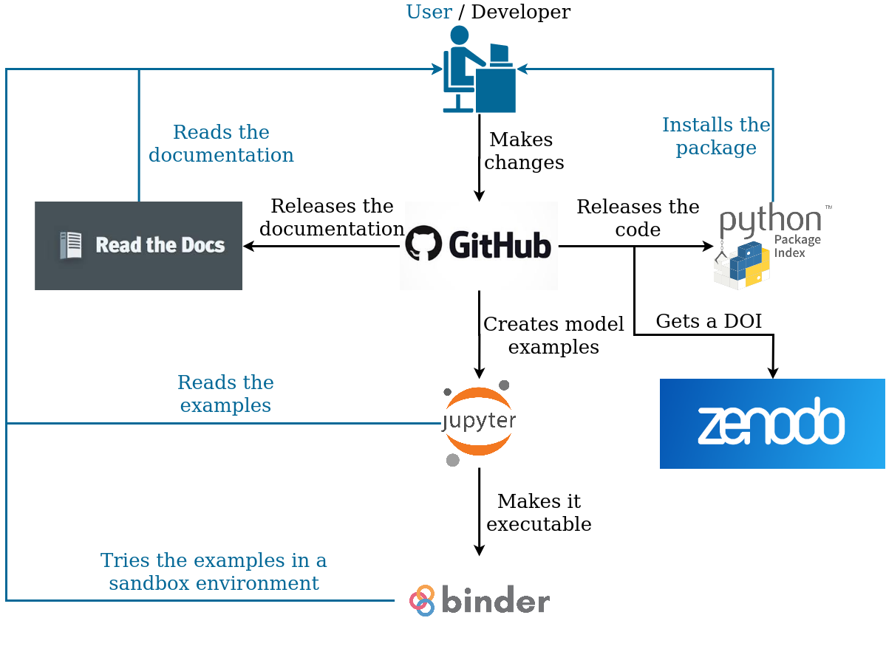

.. note:: Last update 07/09/2020

.. .. warning:: This guide is still work in progress. New pages are being written
..              and existing ones modified. Once the guide will reach its final
..              version, this box will disappear.

.. _contribute:

Software organization and contribution
======================================

The superflexPy framework is composed by different pieces that are necessary to
fully understand and use the framework:

- **Source code**: it contains all the code necessary to use the framework at
  its latest (and potentially unstable) version. It should be accessed only by
  an advanced user who wants to understand the internal functioning, install
  manually the latest version, or expand the framework.
- **Packaged release**: it allows the user to easily get and install a stable
  version of the framework.
- **Documentation**: it explains the functioning of the framework in its
  details.
- **Examples**: they are the "place-to-start" for a new user, providing working
  models and showcasing potential applications.
- **Scientific publication**: it is a peer-reviewed publication that presents
  the framework to the public and puts it in prospective with other existing
  solutions.

Source code, documentation, and examples are part of the official repository of
SuperflexPy that is hosted on
`GitHub <https://github.com/dalmo1991/superflexPy>`_. The repository is the only
place where code, documentation, and examples should be modified.

New releases of the software are distributed through the official Python Package
Index (PyPI) where SuperflexPy has a
`dedicated page <https://pypi.org/project/superflexpy/>`_.

Documentation is built automatically from the
`source folder <https://github.com/dalmo1991/superflexPy/tree/master/doc>`_ on
GitHub and published online in a
`dedicated website <https://superflexpy.readthedocs.io/>`_.

Examples are made available on GitHub as Jupyter notebooks and can be either
`visualized statically <TODO>`_ or run in a `sandbox environment <TODO>`_.

The scientific publication is currently in preparation and it will be linked
here once accepted.

Contribution
------------

Contribution to the framework can be made in different ways. Types of
contributions include:

- Submit issues on bugs, desired features, etc.
- Solve open issues.
- Extend the documentation with new use cases.
- Extend or modify the framework.
- Use and advertize the framework in your publication.

`This page <https://www.dataschool.io/how-to-contribute-on-github/>`_
illustrates the typical workflow that should be followed when contributing to a
GitHub project. Please, try to follow it.

Branching scheme
................

Updates to SuperflexPy are made directly in the branch :code:`master`, which
represent the most up-to-date branch. The branch :code:`release` is not actively
updated since the only action that should be done is a merge from the
:code:`master`, once a tangible update is available.

When something gets pushed to the branch :code:`release`, a new version of the
package is automatically released on PyPI. Remember to change the version
number in the :code:`setup.py` file.

Developers are free to create new branches but pull requests must be directed to
:code:`master` and not to :code:`release`.

Documentation and examples are generated from the content of the :code:`master`
branch.
