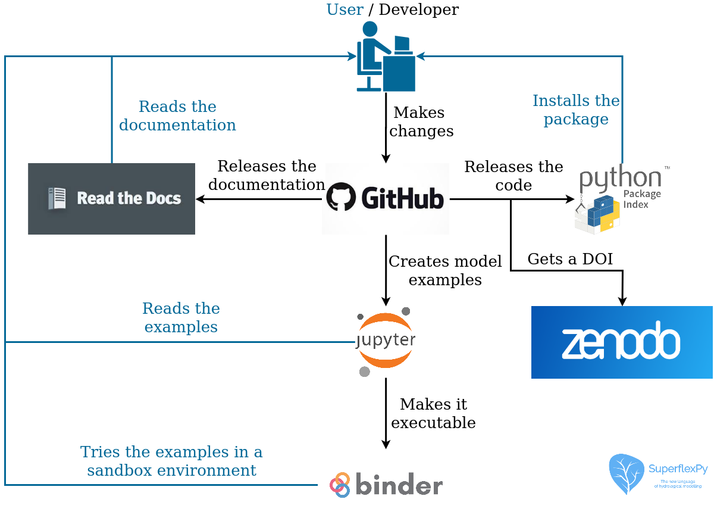

.. note:: Last update 22/07/2021

.. .. warning:: This guide is still work in progress. New pages are being written
..              and existing ones modified. Once the guide will reach its final
..              version, this box will disappear.

.. _contribute:

Software organization and contribution
======================================

The SuperflexPy framework comprises the following components:

- **Source code**: Latest version of all the code necessary to use the
  framework. The source code would normally be accessed only by advanced
  users, e.g. to understand the internal organization of the framework, to install
  manually the latest version, to extend the framework with new
  functionality, etc.
- **Packaged release**: Latest stable version of the framework available for
  users.
- **Documentation**: Detailed explanation of the framework.
- **Examples**: Introduction to SuperflexPy for a new user, providing working
  models and demonstrating potential applications.
- **Scientific references**: Publications that present and/or use
  the framework in scientific contexts.

The source code, documentation, and examples are part of the official repository
of SuperflexPy hosted on `GitHub <https://github.com/dalmo1991/superflexPy>`_.
A user who wishes to read the source code and/or modify any aspect of
SuperflexPy (source code, documentation, and examples) can do it using GitHub.

New releases of the software are available from the official Python Package
Index (PyPI), where SuperflexPy has a
`dedicated page <https://pypi.org/project/superflexpy/>`_.

The documentation builds automatically from the
`source folder <https://github.com/dalmo1991/superflexPy/tree/master/doc>`_ on
GitHub and is published online in
`Read the Docs <https://superflexpy.readthedocs.io/>`_.

Examples are available on GitHub as Jupyter notebooks. These examples can be
visualized statically or run in a sandbox environment (Binder). Refer to :ref:`examples` for
a list of the available examples.

The scientific publication introducing SuperflexPy has been published in
*Geoscientific Model Development* (`link <https://doi.org/10.5194/gmd-14-7047-2021>`_).

Contributions
-------------

Contributions to the framework can be made in the following ways:

- Submit issues on bugs, desired features, etc;
- Solve open issues;
- Extend the documentation with new demos and examples;
- Extend and/or modify the framework;
- Use and cite the framework in your publications.

Code contribution by external users will be mainly additive (i.e., adding new
components, as illustrated in :ref:`build_element` and :ref:`customize_components`)
and should include also appropriate testing (:ref:`tests`).

Contributors will maintain authorship of the contributed code and are invited
to include, in all files, their contact information to facilitate future
collaboration. The authors and maintainers of SuperflexPy will undertake a basic
inspection of the contributed code to identify any quality issues.

The typical workflow that should be followed when contributing to a GitHub
project is described
`here <https://www.dataschool.io/how-to-contribute-on-github/>`_.

In summary,
the following steps should be followed:

1. Fork the SuperflexPy repository to the user GitHub account;
2. Clone the fork on the user computer;
3. Modify the code, commit the changes, and push them to the GitHub fork of
   SuperflexPy;
4. Make a pull request on GitHub to the SuperflexPy repository.

Branching scheme of the GitHub repository
.........................................

Updates to SuperflexPy are made directly in the branch :code:`master`, which
is the most up-to-date branch. The branch :code:`release` is used only
for the staging of new software releases and, therefore, code should not be
pushed directly to it.

When a code update is merged from :code:`master` to :code:`release`, a
new version of the package is automatically released on PyPI. Remember to update
the version number in the :code:`setup.py` file to avoid conflicts.

Developers are free to create new branches, but pull requests must be directed to
:code:`master` and not to :code:`release`.

Documentation and examples are generated from the :code:`master`
branch.
