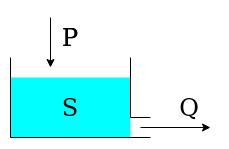
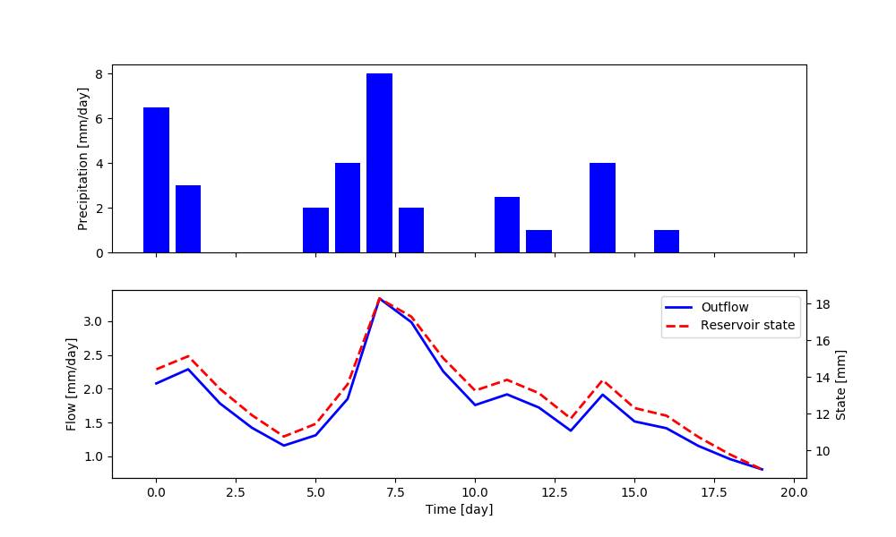
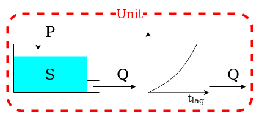
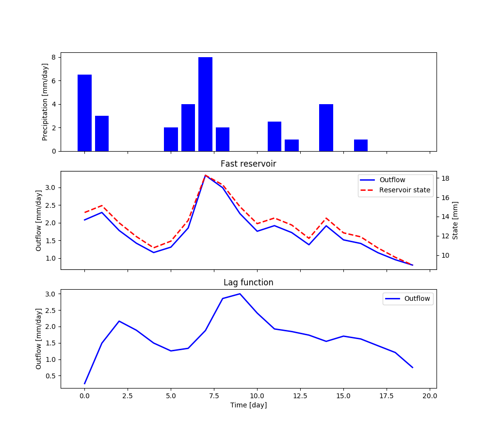
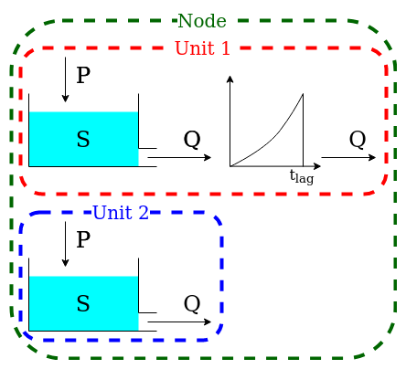
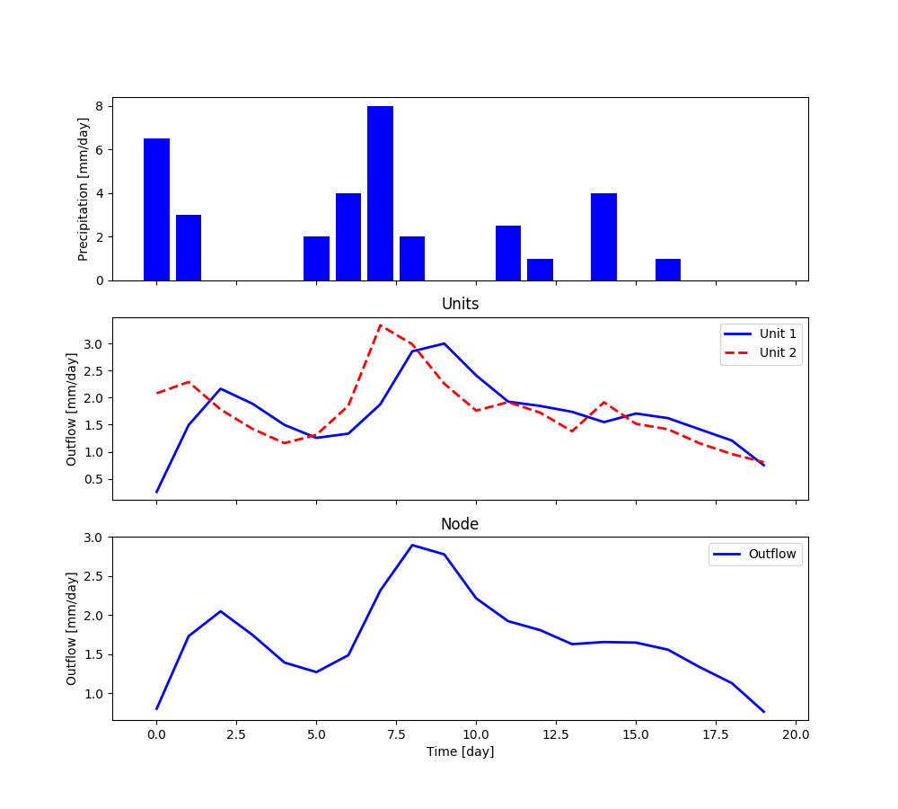
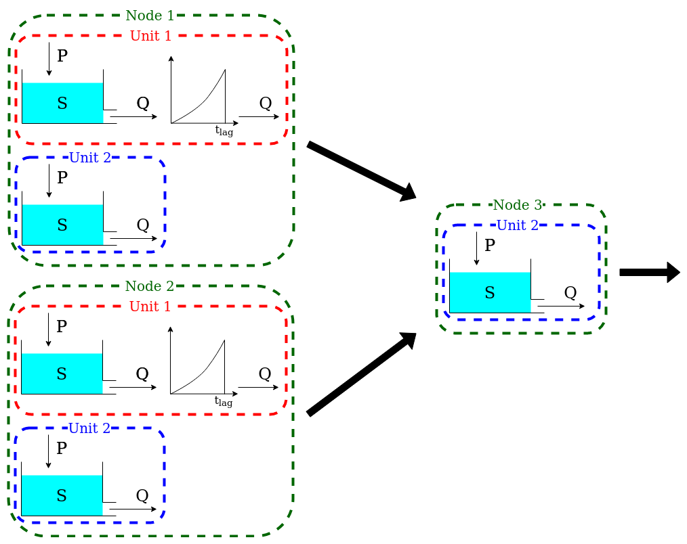
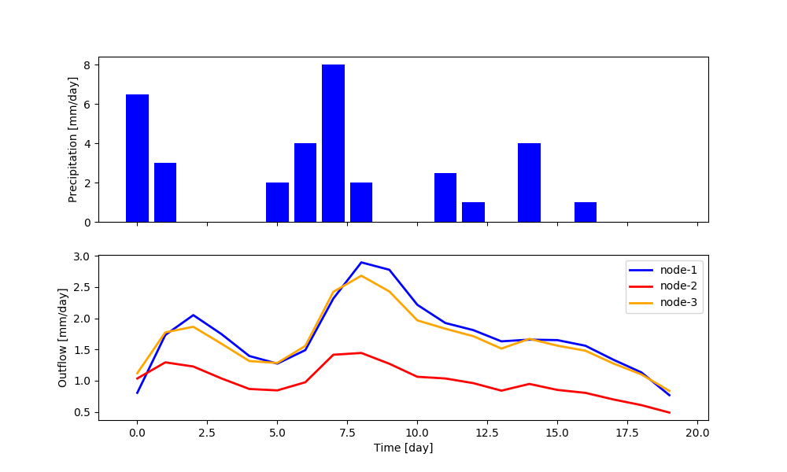

.. TODO:
.. - check if the inspect are implemented correctly

.. note:: Last update 18/11/2020

.. .. warning:: This guide is still work in progress. New pages are being written
..              and existing ones modified. Once the guide will reach its final
..              version, this box will disappear.

.. _demo:

How to build a model with SuperflexPy
=====================================

This page shows how to build a complete semi-distributed conceptual model with
SuperflexPy, including:

1. how the elements are initialized, configured, and run
2. how to use the model at any level of complexity, from single element to
   multiple nodes.

All the models presented in this section are available as runnable examples (see
:ref:`examples`).

Examples of the implementation of more realistic models are given in the pages
:ref:`popular_models` and :ref:`case_studies`.

Importing SuperflexPy
---------------------

Assuming that SuperflexPy is already installed (see :ref:`installation_label`
guide), the elements needed to build the model are imported from the SuperflexPy
package. For this demo, this is done with the following lines

.. literalinclude:: demo_code.py
   :language: python
   :lines: 8-14
   :linenos:

Lines 1-2 import the two elements that we will use (a reservoir and a lag
function), lines 3-4 import the numerical solver used to solve the reservoir
equation, and lines 5-7 import the components of SuperflexPy needed to make the
model spatially distributed.

A complete list of the elements already implemented in SuperflexPy, including
their equations and import path, is available in page :ref:`elements_list`. If
the desired element is not available, it can be built following the instructions
given in page :ref:`build_element`.

Simplest lumped model structure with single element
---------------------------------------------------

The single-element model is composed by a single reservoir governed by the
differential equation

.. math::
   \frac{\textrm{d}S}{\textrm{d}t}=P-Q

where :math:`S` is the state (storage) of the reservoir, :math:`P` is the
precipitation input, and :math:`Q` is the outflow.

The outflow is defined by the equation:

.. math::
   Q = kS^\alpha

where :math:`k` and :math:`\alpha` are parameters of the element.

For simplicity, evapotranspiration is not considered in this demo.

The first step is to initialize the numerical approximator (see
:ref:`numerical_solver`). In this case, we will use the native Python
implementation (i.e. not Numba) of the implicit Euler algorithm (numerical
approximator) and the Pegasus algorithm (root finder). The initialization can be
done with the following code, where the default settings of the solver are used
(refer to the solver docstring).

.. literalinclude:: demo_code.py
   :language: python
   :lines: 20, 18, 21
   :linenos:

The element is initialized next

.. literalinclude:: demo_code.py
   :language: python
   :lines: 24-29
   :linenos:

During initialization, parameters (line 2) and initial state (line 3) are
defined, together with the numerical approximator and the identifier (the
identifier must be unique and cannot contain the character :code:`_`, see
:ref:`identifier`).

After initialization, the time step used to solve the differential equation and
the inputs of the element are specified.

.. literalinclude:: demo_code.py
   :language: python
   :lines: 31, 38
   :linenos:

:code:`precipitation` is a Numpy array containing the precipitation time series.
Note that the length of the simulation (i.e., the number of time steps to run
the model) is automatically set to the length of the input arrays.

At this point, the element can be run, calling the method :code:`get_output`

.. literalinclude:: demo_code.py
   :language: python
   :lines: 41
   :linenos:

The method will run the element for all the time steps, solving the differential
equation and returning a list containing all output arrays of the element (in
this specific case there is only one output array, i.e., the flow time series
:math:`Q`).

The state of the reservoir at all time steps is saved in the :code:`state_array`
attribute of the element and can be accessed as follows

.. literalinclude:: demo_code.py
   :language: python
   :lines: 42
   :linenos:

:code:`state_array` is a 2D array with the number of rows equal to the number of
time steps, and the number of columns equal to the number of states. The order
of states is defined in the docstring of the element.

With the following code we can create a plot showing the outputs of the
simulation.

.. literalinclude:: demo_code.py
   :language: python
   :lines: 45, 46, 48, 50, 51
   :linenos:

Note that the method :code:`get_output` also sets the element states to their
value at the final time step (in this case 8.98). This is done because it may be
necessary to continue the simulation afterwards (e.g. real time applications
with new inputs coming in time). As a consequence, if the method is called
again, it will use this value as initial state instead of the one defined at
initialization. The states of the model can be reset using the method
:code:`reset_states`.

.. literalinclude:: demo_code.py
   :language: python
   :lines: 66
   :linenos:

.. _demo_unit:

Lumped model structure with 2 elements
--------------------------------------

We now move to a more complex model structure where multiple elements are
connected in a unit. For simplicity, we limit the complexity to two elements;
more complex configurations can be found in the :ref:`popular_models` page.

The unit structure comprises a reservoir that feeds a lag function. The lag
function convolves the incoming flux using the function

.. math::
   Q_{\textrm{out}}=Q_{\textrm{in}} \left(\frac{t}{t_{\textrm{lag}}}\right)^
   {\frac{5}{2}} \qquad \textrm{for }t<t_{\textrm{lag}}

and its behavior is controlled by parameter :math:`t_{\textrm{lag}}`.

First, we initialize the two elements that compose the unit structure

.. literalinclude:: demo_code.py
   :language: python
   :lines: 24-30, 69-73
   :linenos:

Note that the initial state of the lag function is set to :code:`None`
(line 10); in this case the element will initialize the state to an arrays of
zeros of appropriate length, depending on the value of :math:`t_{\textrm{lag}}`
(in this specific case, :code:`ceil(2.3) = 3`).

Next, we initialize the unit that combines the elements

.. literalinclude:: demo_code.py
   :language: python
   :lines: 76-79
   :linenos:

Line 2 defines the unit structure: it is a 2D list where the inner level sets
the elements belonging to each layer and the outer level lists the layers.

After initialization, time step size and inputs are defined

.. literalinclude:: demo_code.py
   :language: python
   :lines: 81, 83
   :linenos:

The unit sets the time step size for all its elements and transfers the inputs to the
first element (in this example, to the reservoir).

The unit can now be run

.. literalinclude:: demo_code.py
   :language: python
   :lines: 86
   :linenos:

The unit will call the :code:`get_output` method of all its elements (from
upstream to downstream) set the inputs of the downstream elements to the output
of their respective upstream elements, and return the output of the last
element.

After the unit simulation has completed, the outputs and the states of its
elements can be retrieved as follows

.. literalinclude:: demo_code.py
   :language: python
   :lines: 89-90
   :linenos:

Note that in line 2 we pass the argument :code:`solve=False` to the function
:code:`get_output`  in order to access the computed states and outputs without
re-running the reservoir element.

The plot shows the output of the simulation (obtained by plotting
:code:`output`, :code:`r_state`, and :code:`r_output`).

The elements of the unit can be re-set to their initial state

.. literalinclude:: demo_code.py
   :language: python
   :lines: 126
   :linenos:

.. _demo_mult_nodes:

Simple semi-distributed model
-----------------------------

This model is intended to represent a spatially semi-distributed configuration.
A node is used to represent a catchment that is composed by different areas that
react differently to the same inputs. For example, suppose we represent 70% of
the catchment using the structure described in :ref:`demo_unit`, and the
remaining 30% using a single reservoir.

This model configuration is achieved using a node with multiple units.

First, we initialize the two units and the elements composing them, in the same
way as in the previous sections.

.. literalinclude:: demo_code.py
   :language: python
   :lines: 24-30, 69-74, 76-80, 130-133
   :linenos:

Note that, once the elements are added to a unit, they become independent (see
:ref:`unit`), meaning that any change to the reservoir contained in
:code:`unit-1` does not affect the reservoir contained in :code:`unit-2`.

The next step is to initialize the node, which combines the two units

.. literalinclude:: demo_code.py
   :language: python
   :lines: 136-141
   :linenos:

Line 2 contains the list of units that belong to the node, and line 3 gives
their weight (i.e. the portion of the node outflow coming from each unit). Line
4 specifies the representative area of the node.

Next, we define the time step size and the model inputs

.. literalinclude:: demo_code.py
   :language: python
   :lines: 143-144
   :linenos:

The same time step size will be assigned to all elements within the node, and
the inputs will be passed to all the units of the node.

We can now run the node and collect its output

.. literalinclude:: demo_code.py
   :language: python
   :lines: 147
   :linenos:

The node will call the method :code:`get_output` of all its units and aggregate
their outputs using the weights.

The outputs of the single units, as well as the states and fluxes of the
elements composing them, can be retrieved using the method :code:`call_internal`

.. literalinclude:: demo_code.py
   :language: python
   :lines: 149-150
   :linenos:

The plot shows the output of the simulation.

All elements within the node can be re-set to their initial states

.. literalinclude:: demo_code.py
   :language: python
   :lines: 178
   :linenos:

Semi-distributed model with multiple nodes
------------------------------------------

A catchment can be composed by several subcatchments (nodes) connected in a
network, where each subcatchment receives its own inputs, but may share
parameter values with other subcatchments with the same units. This
semi-distributed configuration can be implemented in SuperflexPy by creating a
network with multiple nodes.

First, we initialize the nodes

.. literalinclude:: demo_code.py
   :language: python
   :lines: 24-30, 69-74, 76-80, 130-134, 136-142, 182-194
   :linenos:

:code:`node-1` and :code:`node-2` contain both units but in different
proportions. :code:`node-3` contains only :code:`unit-2`.

When units are added to a node, the states of the elements belonging to them
remain independent while the parameters stay linked, meaning that the change of
a parameter in :code:`unit-1` in :code:`node-1` is applied also to
:code:`unit-1` in :code:`node-2`. As noted in section :ref:`components_node`,
different behavior can be achieved by setting the parameter
:code:`shared_parameters` to :code:`False` when initializing the nodes.

At this point, the network can be initialized

.. literalinclude:: demo_code.py
   :language: python
   :lines: 197-204
   :linenos:

Line 2 lists the nodes belonging to the network. Lines 4-6 define the
connectivity of the network; this is done using a dictionary with the keys given
by the node identifiers and values given by the single downstream node. The
most downstream node has value :code:`None`.

The inputs are catchment-specific and must be provided to each node.

.. literalinclude:: demo_code.py
   :language: python
   :lines: 206-208
   :linenos:

The time step size is defined at the network level.

.. literalinclude:: demo_code.py
   :language: python
   :lines: 210
   :linenos:

We can now run the network and get the output values

.. literalinclude:: demo_code.py
   :language: python
   :lines: 212
   :linenos:

The network runs the nodes from upstream to downstream, collects their outputs,
and routes them to the outlet. The output of the network is a dictionary, with
keys given by the node identifiers and values given by the list of output
fluxes. It is also possible to retrieve the internals (e.g. fluxes, states,
etc.) of the nodes.

.. literalinclude:: demo_code.py
   :language: python
   :lines: 214-216
   :linenos:

The plot shows the results of the simulation.

