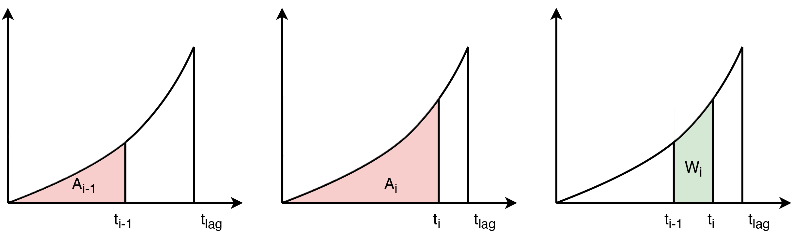

.. note:: Last update 18/11/2020

.. .. warning:: This guide is still work in progress. New pages are being written
..              and existing ones modified. Once the guide will reach its final
..              version, this box will disappear.

.. _elements_list:

List of currently implemented elements
======================================

SuperflexPy provides a large variety of components (i.e., elements, units, nodes
and network) for constructing conceptual hydrological models. The components
presented in the page :ref:`components` represent the core of SuperflexPy.
However, such components must be extended to create customized models.

Most of the customization regards elements (i.e., reservoirs, lag, and
connection elements). This page contains all the elements implemented extending
the classes provided by SuperflexPy and made available to the users to construct
models. The elements are divided in three categories

- Reservoir
- Lag elements
- Connections

The elements are listed in alphabetical order.

Reservoirs
----------

Interception filter
*******************

This reservoir is used to simulate interception in models, including GR4J.
Further details are provided in the page :ref:`gr4j_example`.

.. code-block:: python

   from superflexpy.implementation.elements.gr4j import InterceptionFilter

Inputs
......

- Potential evapotranspiration :math:`E^{\textrm{in}}_{\textrm{POT}}\ [LT^{-1}]`
- Precipitation :math:`P^{\textrm{in}}\ [LT^{-1}]`

Outputs from :code:`get_output`
...............................

- Net potential evapotranspiration :math:`E^{\textrm{out}}_{\textrm{POT}}\ [LT^{-1}]`
- Net precipitation :math:`P^{\textrm{out}}\ [LT^{-1}]`

Governing equations
...................

.. math::
   & \textrm{if } P^{\textrm{in}} > E^{\textrm{in}}_{\textrm{POT}}: \\
   & \quad P^{\textrm{out}} = P^{\textrm{in}} - E^{\textrm{in}}_{\textrm{POT}} \\
   & \quad E^{\textrm{out}}_{\textrm{POT}} = 0 \\ \\
   & \textrm{if } P^{\textrm{in}} < E^{\textrm{in}}_{\textrm{POT}}: \\
   & \quad P^{\textrm{out}} = 0 \\
   & \quad E^{\textrm{out}}_{\textrm{POT}} = E^{\textrm{in}}_{\textrm{POT}} - P^{\textrm{in}}

Linear reservoir
****************

This reservoir assumes a very simple linear storage-discharge relationship. It
represents arguably the simplest hydrological model. For example, it is used in
the model HYMOD to simulate channel routing and lower-zone storage processes.
Further details are provided in the page :ref:`hymod`.

.. code-block:: python

   from superflexpy.implementation.elements.hymod import LinearReservoir

Inputs
......

- Precipitation :math:`P\ [LT^{-1}]`

Outputs from :code:`get_output`
...............................

- Total outflow :math:`Q\ [LT^{-1}]`

Governing equations
...................

.. math::
   & \frac{\textrm{d}S}{\textrm{d}{t}}=P - Q \\
   & Q=kS

Power reservoir
***************

This reservoir assumes that the storage-discharge relationship is described by a
power function. This type of reservoir is common in hydrological models, in
particular in the HBV family of models where it is used to represent the fast
response of a catchment.

.. code-block:: python

   from superflexpy.implementation.elements.hbv import PowerReservoir

Inputs
......

- Precipitation :math:`P\ [LT^{-1}]`

Outputs from :code:`get_output`
...............................

- Total outflow :math:`Q\ [LT^{-1}]`

Governing equations
...................

.. math::
   & \frac{\textrm{d}S}{\textrm{d}{t}}=P - Q \\
   & Q=kS^{\alpha}

Production store (GR4J)
***********************

This reservoir is used to simulate runoff generation in the model GR4J. Further
details are provided in the page :ref:`gr4j_example`.

.. code-block:: python

   from superflexpy.implementation.elements.gr4j import ProductionStore

Inputs
......

- Potential evapotranspiration :math:`E_{\textrm{pot}}\ [LT^{-1}]`
- Precipitation :math:`P\ [LT^{-1}]`

Outputs from :code:`get_output`
...............................

- Total outflow :math:`P_{\textrm{r}}\ [LT^{-1}]`

Secondary outputs
.................

- Actual evapotranspiration :math:`E_{\textrm{act}}\ [LT^{-1}]` :code:`get_aet()`

Governing equations
...................

.. math::
   & \frac{\textrm{d}S}{\textrm{d}{t}}=P_{\textrm{s}}-E_{\textrm{act}}-Q_{\textrm{perc}} \\
   & P_{\textrm{s}}=P\left(1-\left(\frac{S}{x_1}\right)^\alpha\right) \\
   & E_{\textrm{act}}=E_{\textrm{pot}}\left(2\frac{S}{x_1}-\left(\frac{S}{x_1}\right)^\alpha\right) \\
   & Q_{\textrm{perc}} = \frac{x^{1-\beta}}{(\beta-1)}\nu^{\beta-1}S^{\beta} \\
   & P_{\textrm{r}}=P - P_{\textrm{s}} + Q_{\textrm{perc}}

Routing store (GR4J)
********************

This reservoir is used to simulate routing in the model GR4J. Further details
are provided in the page :ref:`gr4j_example`.

.. code-block:: python

   from superflexpy.implementation.elements.gr4j import RoutingStore

Inputs
......

- Precipitation :math:`P\ [LT^{-1}]`

Outputs from :code:`get_output`
...............................

- Outflow :math:`Q\ [LT^{-1}]`
- Loss term :math:`F\ [LT^{-1}]`

Governing equations
...................

.. math::
   & \frac{\textrm{d}S}{\textrm{d}{t}}=P-Q-F \\
   & Q=\frac{x_3^{1-\gamma}}{(\gamma-1)}S^{\gamma} \\
   & F = \frac{x_2}{x_3^{\omega}}S^{\omega}

Snow reservoir
**************

This reservoir is used to simulate snow processes based on temperature. Further
details are provided in the page :ref:`thur_case_study`.

.. code-block:: python

   from superflexpy.implementation.elements.thur_model_hess import SnowReservoir

Inputs
......

- Precipitation :math:`P\ [LT^{-1}]`
- Temperature :math:`T\ [°C]`

Outputs from :code:`get_output`
...............................

- Sum of snow melt and rainfall input :math:`=P-P_{\textrm{snow}}+M\ [LT^{-1}]`

Governing equations
...................

.. math::
   & \frac{\textrm{d}S}{\textrm{d}{t}}=P_{\textrm{snow}}-M \\
   & P_{\textrm{snow}}=P\quad\textrm{if } T\leq T_0;\quad\textrm{else } 0 \\
   & M = M_{\textrm{pot}}\left(1-\exp\left(-\frac{S}{m}\right)\right) \\
   & M_{\textrm{pot}}=kT\quad\textrm{if } T\geq T_0;\quad\textrm{else } 0 \\

Unsaturated reservoir (inspired to HBV)
***************************************

This reservoir specifies the actual evapotranspiration as a smoothed threshold
function of storage, in combination with the storage-discharge relationship
being a power function. It is inspired by the HBV family of models, where a
similar (but non-smooth) approach is used to represent unsaturated soil
dynamics.

.. code-block:: python

   from superflexpy.implementation.elements.hbv import UnsaturatedReservoir

Inputs
......

- Precipitation :math:`P\ [LT^{-1}]`
- Potential evapotranspiration :math:`E_{\textrm{pot}}\ [LT^{-1}]`

Outputs from :code:`get_output`
...............................

- Total outflow :math:`Q\ [LT^{-1}]`

Secondary outputs
.................

- Actual evapotranspiration :math:`E_{\textrm{act}}` :code:`get_AET()`

Governing equations
...................

.. math::
   & \frac{\textrm{d}S}{\textrm{d}{t}}=P - E_{\textrm{act}} - Q \\
   & \overline{S} = \frac{S}{S_{\textrm{max}}} \\
   & E_{\textrm{act}}=C_{\textrm{e}}E_{\textrm{pot}}\left(\frac{\overline{S}(1+m)}{\overline{S}+m}\right) \\
   & Q=P\left(\overline{S}\right)^{\beta}

Upper zone (Hymod)
******************

This reservoir is part of the Hymod model and it is used to simulate th upper
zone. Further details are provided in the page :ref:`hymod`.

.. code-block:: python

   from superflexpy.implementation.elements.hymod import UpperZone

Inputs
......

- Precipitation :math:`P\ [LT^{-1}]`
- Potential evapotranspiration :math:`E_{\textrm{pot}}\ [LT^{-1}]`

Outputs from :code:`get_output`
...............................

- Total outflow :math:`Q\ [LT^{-1}]`

Secondary outputs
.................

- Actual evapotranspiration :math:`E_{\textrm{act}}\ [LT^{-1}]` :code:`get_AET()`

Governing equations
...................

.. math::
   & \frac{\textrm{d}S}{\textrm{d}{t}}=P - E_{\textrm{act}} - Q \\
   & \overline{S} = \frac{S}{S_{\textrm{max}}} \\
   & E_{\textrm{act}}=E_{\textrm{pot}}\left(\frac{\overline{S}(1+m)}{\overline{S}+m}\right) \\
   & Q=P\left(1-\left(1-\overline{S}\right)^{\beta}\right)

Lag elements
------------

All lag elements implemented in SuperflexPy are designed to take an arbitrary
number of input fluxes, and apply a convolution based on a weight array that
defines the shape of the lag function.

Different lag elements differ solely in the values of the weight array. The
nature (i.e., number and order) of inputs and outputs depends on the element
upstream the lag element.

The weight array can be defined by giving the area below the lag function as a
function of the time coordinate. The maximum lag :math:`t_{\textrm{lag}}` must
also be specified. The weights are then given by differences between the values
of the area at consecutive lags. This approach is shown in the figure above,
where the weight :math:`W_i` is calculated as the difference of areas
:math:`A_i` and :math:`A_{i-1}`.

Half triangular lag
*******************

This lag element implements the element present in the case study
:ref:`thur_case_study` and used in other Superflex studies.

.. code-block:: python

   from superflexpy.implementation.elements.thur_model_hess import HalfTriangularLag

Definition of weight array
..........................

The value of the area below the lag function is given by

.. math::

   &A_{\textrm{lag}}(t) = 0 & \quad \textrm{for } t \leq 0\\
   &A_{\textrm{lag}}(t) = \left(\frac{t}{t_{\textrm{lag}}}\right)^2 & \quad \textrm{for } 0< t \leq t_{\textrm{lag}}\\
   &A_{\textrm{lag}}(t) = 1 & \quad \textrm{for } t > t_{\textrm{lag}}

The weight array is then calculated as

.. math::

   w(t_{\textrm{i}}) = A_{\textrm{lag}}(t_{\textrm{i}}) - A_{\textrm{lag}}(t_{\textrm{i-1}})

Unit hydrograph 1 (GR4J)
************************

This lag element implements the unit hydrograph of :ref:`gr4j_example`.

.. code-block:: python

   from superflexpy.implementation.elements.gr4j import UnitHydrograph1

Definition of weight array
..........................

The value of the area below the lag function is given by

.. math::

   &A_{\textrm{lag}}(t) = 0 & \quad \textrm{for } t \leq 0\\
   &A_{\textrm{lag}}(t) = \left(\frac{t}{t_{\textrm{lag}}}\right)^\frac{5}{2} & \quad \textrm{for } 0< t \leq t_{\textrm{lag}}\\
   &A_{\textrm{lag}}(t) = 1 & \quad \textrm{for } t > t_{\textrm{lag}}

The weight array is then calculated as

.. math::

   w(t_{\textrm{i}}) = A_{\textrm{lag}}(t_{\textrm{i}}) - A_{\textrm{lag}}(t_{\textrm{i-1}})

Unit hydrograph 2 (GR4J)
************************

This lag element implements the unit hydrograph of :ref:`gr4j_example`.

.. code-block:: python

   from superflexpy.implementation.elements.gr4j import UnitHydrograph2

Definition of weight array
..........................

The value of the area below the lag function is given by

.. math::

   &A_{\textrm{lag}}(t) = 0 & \quad \textrm{for } t \leq 0\\
   &A_{\textrm{lag}}(t) = \frac{1}{2}\left(\frac{2t}{t_{\textrm{lag}}}\right)^\frac{5}{2} & \quad \textrm{for } 0< t \leq \frac{t_{\textrm{lag}}}{2}\\
   &A_{\textrm{lag}}(t) = 1 - \frac{1}{2}\left(2-\frac{2t}{t_{\textrm{lag}}}\right)^\frac{5}{2} & \quad \textrm{for } \frac{t_{\textrm{lag}}}{2}< t \leq t_{\textrm{lag}}\\
   &A_{\textrm{lag}}(t) = 1 & \quad \textrm{for } t > t_{\textrm{lag}}

The weight array is then calculated as

.. math::

   w(t_{\textrm{i}}) = A_{\textrm{lag}}(t_{\textrm{i}}) - A_{\textrm{lag}}(t_{\textrm{i-1}})

Connections
-----------

SuperflexPy implements four connection elements:

- splitter
- junction
- linker
- transparent element

In addition, customized connectors have been implemented to achieve a specific
model design. These customized elements are listed in this section.

Flux aggregator (GR4J)
**********************

This element is used to combine routing, exchange and outflow fluxes in the
GR4J model. Further details are provided in the page
:ref:`gr4j_example`.

.. code-block:: python

   from superflexpy.implementation.elements.gr4j import FluxAggregator

Inputs
......

- Outflow routing store :math:`Q_{\textrm{RR}}\ [LT^{-1}]`
- Exchange flux :math:`Q_{\textrm{RF}}\ [LT^{-1}]`
- Outflow UH2 :math:`Q_{\textrm{UH2}}\ [LT^{-1}]`

Main outputs
............

- Outflow :math:`Q\ [LT^{-1}]`

Governing equations
...................

.. math::
   & Q = Q_{\textrm{RR}} + \max(0;Q_{\textrm{UH2}} - Q_{\textrm{RF}}) \\