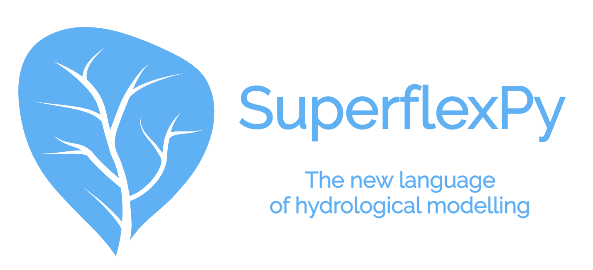

.. warning:: This guide is still work in progress. New pages are being written
             and existing ones modified. Once the guide will reach its final
             version, this box will disappear.

===========
SuperflexPy
===========

SuperflexPy is an open-source framework written in Python for constructing
flexible, conceptual, distributed hydrological models.

SuperflexPy builds on our 10-years-experience with the development and
application of `Superflex <https://doi.org/10.1029/2010WR010174>`_. The
new framework is a completely new implementation of Superflex and 
expands the possibility offered by the old version, allowing you to 
build completely customized, spatially-distributed hydrological models.

Thanks to its object-oriented architecture, SuperflexPy can be easily
extended to satisfy your own needs, creating new elements with a 
completely customized logic, just with a few lines of pure Python code.

Constructing a semi-distributed conceptual hydrological model will be
straightforward with SuperflexPy, with a user experience similar to any
other Python framework:

- inputs and outputs are handled directly by the modeler using common Python
  libraries (e.g. Numpy or Pandas for reading from text files) without the need
  of customized input files and long pre- and post-processing to adapt the data
  to the model;

- the elements of the framework are declared and initialized through a Python
  script, without the need of long and complicated setup text files;

- all the elements of the framework are objects with built-in functionalities
  for handling parameters and states, routing the fluxes, and solving common
  structures present in conceptual models (e.g. reservoirs, lag functions,
  etc.);

- the framework can be run at any level of complexity, from a single bucket
  to an entire river network;

- the framework is easy interface with other Python modules for calibration
  and uncertainty analysis; we will provide an interface to common frameworks.

Team
----

SuperflexPy is actively developed at `Eawag <https://www.eawag.ch>`_,
by researchers in the `Hydrological modelling group 
<https://www.eawag.ch/en/department/siam/main-focus/hydrological-modelling/>`_,
with the support of external people.

The core team consists of:

- `Marco Dal Molin <www.eawag.ch/~dalmolma>`_ (implementation and design)

- `Dr. Fabrizio Fenicia <https://www.eawag.ch/en/aboutus/portrait/organisation/staff/profile/fabrizio-fenicia/show/>`_
  (design and supervision)

- Prof. Dmitri Kavetski (design and supervision)

Stay in touch
-------------

If you want to get e-mails about future developments of the framework, please
subscribe to our mailing list `clicking here
<https://forms.gle/utLbF6KWqvqS7LHZ7>`_.

Code and demos
--------------

The source code can be accessed at the `repository
<https://github.com/dalmo1991/superflexPy/>`_.

A demo, implementing GR4J, is available in a `Colab Notebook
<https://colab.research.google.com/drive/1XBmkTY_1KsP1l8extzhomOOC-vH8PN9j>`_.

.. toctree::
   :maxdepth: 1
   :hidden:

   case_studies