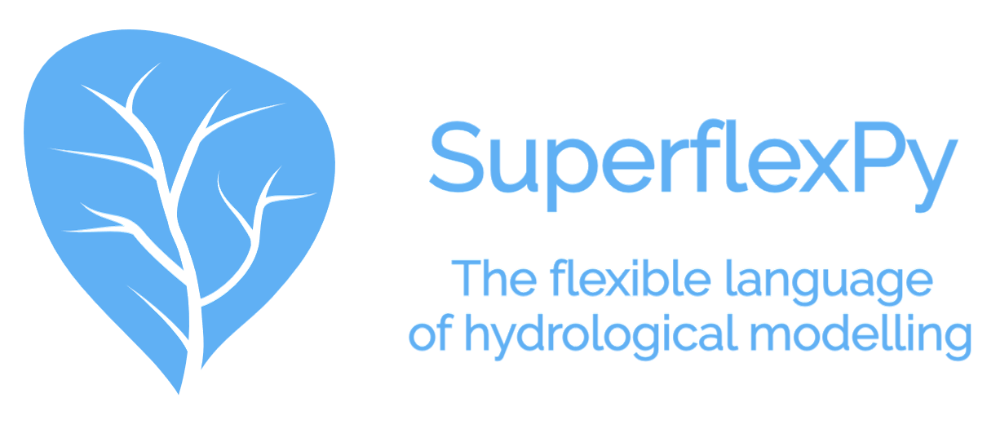

.. .. warning:: This guide is still work in progress. New pages are being written
..              and existing ones modified. Once the guide will reach its final
..              version, this box will disappear.

===========
SuperflexPy
===========

SuperflexPy is an open-source Python framework for constructing conceptual
hydrological models for lumped and semi-distributed applications.

SuperflexPy builds on our 10 year experience with the development and
application of `Superflex <https://doi.org/10.1029/2010WR010174>`_, including
collaborations with colleagues at the Eawag (Switzerland), TU-Delft
(Netherlands), LIST (Luxembourg), University of Adelaide (Australia), and
others. The SuperflexPy framework offers a brand new implementation of
Superflex, allowing the modeler to build fully customized, spatially-distributed
hydrological models.

Thanks to its object-oriented architecture, SuperflexPy can be easily
extended to meet your modelling requirements, including the creation of new
components with customized internal structure, in just a few lines of Python
code.

Constructing a hydrological model is straightforward with SuperflexPy:

- inputs and outputs are handled directly by the modeler using common Python
  libraries (e.g. Numpy or Pandas). The modeller can use hence data files of
  their own design, without the need to pre- and/or post- process
  data into text formats prescribed by the framework itself;

- the framework components are declared and initialized through a Python script;

- the framework components are implemented as classes with built-in functionalities for
  handling parameters and states, routing fluxes, and solving the model
  equations (e.g. describing reservoirs, lag functions, etc.);

- the numerical implementation is separated from the conceptual model, allowing
  the use of different numerical methods for solving the model equations;

- the framework can be run at multiple levels of complexity, from a
  single-bucket model to a model that represents an entire river network;

- the framework is available as an open source Python package from
  `Github <https://github.com/dalmo1991/superflexPy>`_;

- the framework can be easily interfaced with other Python modules for
  calibration and uncertainty analysis.

Team
----

SuperflexPy is developed and maintained by researchers in the
`Hydrological Modelling Group
<https://www.eawag.ch/en/department/siam/main-focus/hydrological-modelling/>`_
at `Eawag <https://www.eawag.ch>`_, with the support of external collaborators.

The core team consists of:

- `Dr. Marco Dal Molin <https://www.linkedin.com/in/dalmolma>`_ (implementation and design)

- `Dr. Fabrizio Fenicia <https://www.eawag.ch/en/aboutus/portrait/organisation/staff/profile/fabrizio-fenicia/show/>`_
  (design and supervision)

- `Prof. Dmitri Kavetski <https://www.adelaide.edu.au/directory/dmitri.kavetski>`_
  (design and supervision)

Stay in touch
-------------

If you wish to receive emails about ongoing SuperflexPy developments\,
please `subscribe <https://forms.gle/utLbF6KWqvqS7LHZ7>`_ to our mailing list.

.. note:: Using SuperflexPy requires a general knowledge of Python and Numpy.
          Other Python libraries may be needed for pre- and post- processing of
          the data.

          In line with the Python terminology, we will use the word **define**
          when referring to the definition of a class, and **initialize** when
          referring to the creation of an instance of a class, i.e. an object.

.. toctree::
   :maxdepth: 1
   :hidden:

   installation
   contribute
   introduction
   components
   numerical_solver
   demo
   elements_list
   build_element
   customize_components
   popular_models
   case_studies
   sfpy_in_literature
   share_models
   interfaces
   examples
   testing
   license
   reference
   changelog
