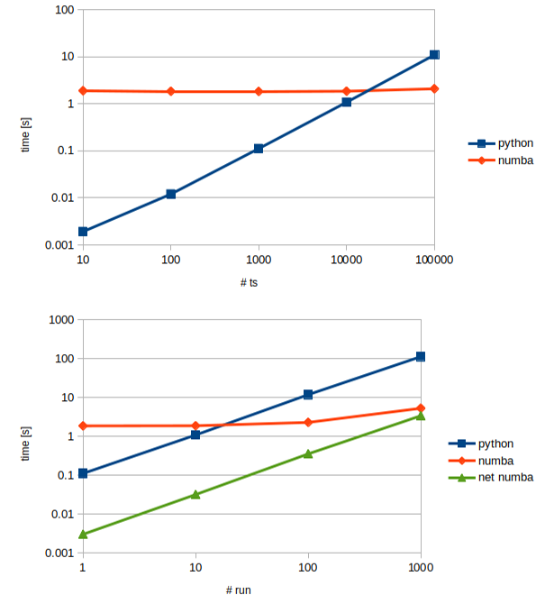

.. note:: Last update 23/08/2021

.. .. warning:: This guide is still work in progress. New pages are being written
..              and existing ones modified. Once the guide will reach its final
..              version, this box will disappear.

.. _numerical_solver:

Numerical implementation
========================

:ref:`reservoirs` are the most common elements in conceptual hydrological
models. Reservoirs are controlled by one (or more) ordinary differential
equations (ODEs) of the form

.. math::
   \frac{\textrm{d}\mathbf{S}}{\textrm{d}t}=\mathbf{I}(\mathbf{\theta}, t)-\mathbf{O}(\mathbf{S}, \mathbf{\theta}, t)

and associated initial conditions.

Such differential equations are usually difficult or impossible to solve
analytically, therefore, numerical methods are employed. These numerical
methods take the form of time stepping schemes.

Available numerical routines to facilitate the solution of ODEs
---------------------------------------------------------------

The current implementation of SuperflexPy conceptualizes the solution
of the ODE as a two-step procedure:

1. Construct the discrete-time equations defining the numerical approximation of
   the ODEs at a single time step, e.g. using Euler methods.
2. Solve the numerical approximation for the storage(s). This step usually require
   some iterative procedure since the algebraic equations resulting from point 1
   are usually implicit.

These steps can be performed extending two SuperflexPy components:
:code:`NumericalApproximator` and :code:`RootFinder`.

SuperflexPy provides three built-in numerical approximators (implicit and explicit
Euler, Runge Kutta 4) and a three root finders (one implementing the Pegasus method,
one the Newton method, and one for explicit algebraic equations).

The suggested configuration, used in several modelling studies with the SUPERFLEX framework,
is to use the Implicit Euler approximation and the Pegasus root finder. This setup,
together with a "one-element-at-a-time" strategy to solve the elements, enables
a very robust solution of the ODEs, since the numerical routines operate on a
single ODE at a time. In such cases, the root finder also operates on a single
algebraic equation at a time. Moreover, the Pegasus root finder implements
bracketing methods, which are guaranteed to converge (to a tolerance within the
common constraints of floating point arithmetic) as long as the initial solution
bounds are known. The Pegasus algorithm is a bracket-based nonlinear solver similar to the well-known Regula Falsi algorithm.
It employs a re-scaling of function values at the bracket endpoints to accelerate
convergence for strongly curved functions. The authors of the paper (`Dowell and Jarratt, 1972 <https://doi.org/10.1007/BF01932959>`_)
claim that the algorithm exhibit superior asymptotic
convergence properties to other modified linear methods.

In order to facilitate the convergence of the root finders and to reduce problems
in calibration, we suggest to use smooth flux functions when implementing the elements
(see `Kavetski and Kuczera, 2007 <https://doi.org/10.1029/2006wr005195>`_).
If a user wants to experiment with discontinuous flux function, specific
ODE solution algorithms should be carefully selected.

The following sections describe how to implement extensions of the classes
:code:`NumericalApproximator` and :code:`RootFinder` and how to write solver that
interfaces directly with the :code:`ODEsElement`, bypassing the current architecture.

Creating a customized numerical approximator
............................................

A customized numerical approximator can be implemented by extending the class
:code:`NumericalApproximator` and implementing two methods: :code:`_get_fluxes`
and :code:`_differential_equation`.

.. literalinclude:: numerical_solver_code.py
   :language: python
   :lines: 20-34
   :linenos:

where :code:`fluxes_fun` is a list of functions used to calculate the fluxes and their derivatives,
:code:`S` is the state that solves the ODE, :code:`S0` is the initial state,
:code:`dt` is the time step, :code:`args` is a list of additional arguments used
by the functions in :code:`fluxes_fun`, and :code:`ind` is the index of the input
arrays to use.

The method :code:`_get_fluxes` is responsible for calculating the fluxes after
the ODE has been solved. This method operates with a vector of states.

The method :code:`_differential_equation` calculates the approximation of the
ODE. It returns the residual of the approximated mass balance equations for a
given value of :code:`S`, the minimum and maximum bounds for the
search of the solution, and the value of the derivative of the residual of the approximated mass balance equations for a
given value of :code:`S` w.r.t. :code:`S`. This method is designed to be interfaced with the root
finder.

For further details, please see the implementation of Implicit and
Explicit Euler.

Creating a customized root finder
.................................

A customized root finder can constructed by extending the class
:code:`RootFinder` implementing the method :code:`solve`.

.. literalinclude:: numerical_solver_code.py
   :language: python
   :lines: 11-17
   :linenos:

where :code:`diff_eq_fun` is a function that calculates the value of the
approximated ODE, :code:`fluxes_fun` is a list of functions used to calculate
the fluxes and their derivatives, :code:`S0` is the initial state, :code:`dt` is the time step,
:code:`args` is a list of additional arguments used by the functions in
:code:`fluxes_fun`, and :code:`ind` is the index of the input arrays to use.

The method :code:`solve` is responsible for finding the numerical solution of
the approximated ODE. In case of failure, the method should either raise a
:code:`RuntimeError` (Python implementation) or return :code:`numpy.nan` (this
is not ideal but it is the suggested workaround because Numba does not support
exceptions handling).

To understand better how the method :code:`solve` works, please see the
implementation of the Pegasus and of the Newton root finders that are currently used in the SuperflexPy
applications.

Building a numerical solver from scratch
........................................

When implementing more advanced numerical schemes, the usage of :code:`NumericalApproximator`
and :code:`RootFinder` may be limiting. One example may be when the user wants
to use a numerical solver from an existing library.

In this case the user has to implement a new class from scratch that implements a :code:`solve`
and a :code:`get_fluxes` method. This class interfaces directly with the :code:`ODEsElement` and
substitutes the combined usage of :code:`NumericalApproximator` and :code:`RootFinder`.

.. literalinclude:: numerical_solver_code.py
   :language: python
   :lines: 37-51
   :linenos:

where :code:`fluxes_fun` is a list of functions used to calculate
the fluxes and their derivatives, :code:`S0` is the initial state, :code:`dt` is the time step,
:code:`args` is a list of additional arguments used by the functions in
:code:`fluxes_fun` (e.g, input fluxes, parameters, etc), and :code:`S` is this the state of the reservoir.

The :code:`solve` method is responsible for "assembling" and solving the differential
equations and their derivatives. The fluxes controlling the differential equations can be calculated,
for any possible state and parameters, using the functions contained in
:code:`fluxes_fun`, which are implemented in the single :code:`ODEsElement`.
The method returns an array (time series) containing the values of the states
according to the time step :code:`dt`. It is important to notice that nothing
forbids to calculate the states at intermediate time steps, keeping in mind
the additional error introduced by considering the fluxes constant over :code:`dt`
(see :ref:`sequential_solution`).

The :code:`get_fluxes` method is responsible for calculating the fluxes, once
the ODEs have already been solved.

SuperflexPy does not implement functioning customized ODEs solvers created from scratch (e.g.,
encapsulating the functionality of external libraries). However, to understand
better how to implement a custom ODEs solver from scratch the user can have a
look at the implementation of the abstract class :code:`NumericalApproximator`,
which represents itself an ODEs solver implemented from scratch.

.. _sequential_solution:

Sequential solution of the elements and numerical approximations
----------------------------------------------------------------

The SuperflexPy framework is built on a model representation that maps to a
directional acyclic graph. Model elements are solved sequentially from upstream
to downstream, with the output from each element being used as input to
its downstream elements.

Moreover, inputs and outputs of the elements are considered constant over the
time step :code:`dt` whereas in reality fluxes vary within the time step; this
choice simplifies the implementation of the framework and is coherent with the
typical format of forcing data such as rainfall, PET, etc, which is tabulated in
discrete steps.

When fixed-step solvers are used (e.g. implicit Euler), this
"one-element-at-a-time" strategy is equivalent to applying the same (fixed-step)
solver to the entire ODE system simultaneously (i.e., no additional
approximation error is introduced), as fixed-step solvers transform the ODE
system into a lower triangular system of nonlinear algebraic equations, which
can be solved using forward elimination. The usage of constant fluxes does not
introduce approximations in this case, since intermediate fluxes are not needed.

However, when solvers with internal substepping are used, the "constant fluxes" choice
introduces additional approximation error, since solvers cannot access the
actual value of the fluxes within the time step but only their approximation
to the average value.

These numerical approximations could be removed only by the coupled solution of the ODEs
system. Alternative solutions could be adopted to reduce the approximation, while
respecting the "one-element-at-a-time" strategy; one option could be, for the elements
to output instead of a single number, an array of values, or a function, or a
specific data structure that allows for returning the values at intermediate time steps. However, all the possibilities
listed in this paragraph are currently not supported by SuperflexPy and not
foreseen as development in the near future.

Computational efficiency with Numpy and Numba
---------------------------------------------

Conceptual hydrological models are often used in computationally demanding
contexts, such as parameter calibration and uncertainty quantification, which
require many model runs (thousands or even millions). Computational efficiency
is therefore an important requirement of SuperflexPy.

Computational efficiency is a potential limitation of pure Python, but
libraries like Numpy and Numba can help in pushing the performance closer to
traditionally fast languages such as Fortran and C.

Numpy provides highly efficient arrays for vectorized operations (i.e.
elementwise operations between arrays). Numba provides a “just-in-time compiler”
that can be used to compile (at runtime) a normal Python method to machine code
that operates efficiently with Numpy arrays. The combined use of Numpy and
Numba is extremely effective when solving ODEs using time stepping schemes, where the method loops through a
vector to perform elementwise operations.

SuperflexPy includes Numba-optimized versions of
:code:`NumericalApproximator` and :code:`RootFinder`, which enable efficient
solution of ODEs describing the reservoir elements.

The figure below compares the execution times of pure Python vs. the Numba
implementation, as a function of the length of the time series (upper panel) and
the number of model runs (lower panel). Simulations were run on a laptop (single
thread), using the :ref:`hymod` model, solved using the implicit Euler numerical solver.

The plot clearly shows the tradeoff between compilation time (which is zero for
Python and around 2 seconds for Numba) versus run time (where Numba is 30 times
faster than Python). For example, a single run of 1000 time steps takes 0.11
seconds with Python and 1.85 seconds with Numba. In contrast, if the same model is run
100 times (e.g., as part of a calibration) the Python version takes 11.75
seconds while the Numba version takes 2.35 seconds.

.. note:: The objective of these plots is to give an idea of time that is topically
          required to perform common modelling applications (e.g., calibration) with SuperflexPy,
          to show the impact of the Numba implementation, and to explain the
          tradeoff between compilation and run time. The results do not
          have to be considered as accurate measurements of the performance
          of SuperflexPy (i.e., rigorous benchmarking).

The green line "net numba" in the lower panel express the run time of the Numba
implementation, i.e., excluding the compilation time.
