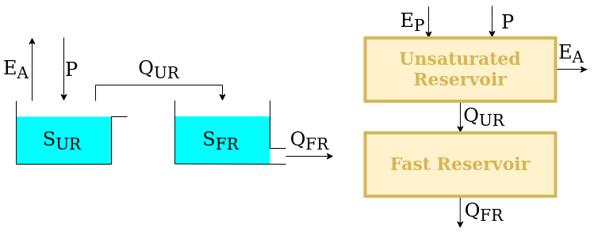
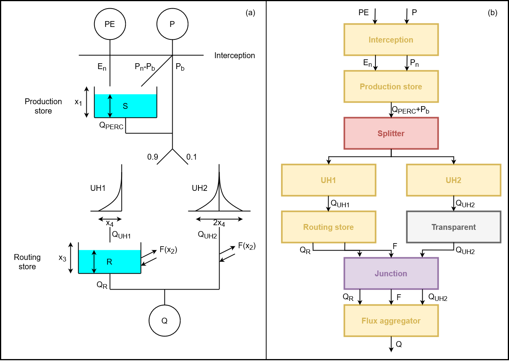
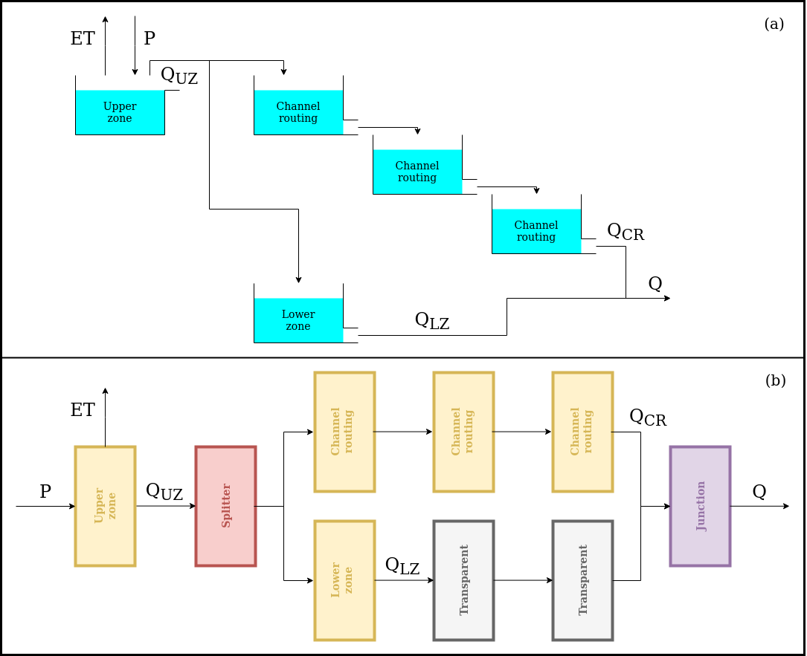

.. TODO:
.. - Final check of correspondence with the paper

.. note:: Last update 21/07/2021

.. .. warning:: This guide is still work in progress. New pages are being written
..              and existing ones modified. Once the guide will reach its final
..              version, this box will disappear.

.. _popular_models:

Application: implementation of existing conceptual models
=========================================================

This page describes the SuperflexPy implementation of several existing conceptual hydrological
models. The "translation" of a model into SuperflexPy requires the
following steps:

1. Design of a structure that reflects the original model but satisfies the
   requirements of SuperflexPy (e.g. does not contain mutual interaction
   between elements, see :ref:`unit`);
2. Extension of the framework, coding the required elements (as explained in
   the page :ref:`build_element`)
3. Construction of the model structure using the elements implemented at step 2

.. _M4_example:

Model M4 from Kavetski and Fenicia, WRR, 2011
---------------------------------------------

M4 is a simple lumped conceptual model presented, as part of a model comparison study,
in the article

    Kavetski, D., and F. Fenicia (2011), **Elements of a flexible approach for**
    **conceptual hydrological modeling: 2. Application and experimental**
    **insights**, WaterResour.Res.,47, W11511, doi:10.1029/2011WR010748.

Design of the model structure
.............................

M4 has a simple structure that can be implemented in SuperflexPy
without using connection elements. The figure shows, on the left, the structure
as presented in the original M4 publication; on the right, a schematic of the SuperflexPy
implementation is shown.

The upstream element, namely, the unsaturated reservoir (UR), is intended to represent
runoff generation processes (e.g. separation between evaporation and runoff). It
is controlled by the differential equation

.. math::
   & \overline{S} = \frac{S_{\textrm{UR}}}{S_{\textrm{max}}} \\
   & \frac{\textrm{d}S_{\textrm{UR}}}{\textrm{d}t} = P -
   E_{\textrm{P}} \left( \frac{\overline{S} \left(1+m\right)}{\overline{S} + m} \right) -
   P \left(\overline{S}\right)^\beta \\

The downstream element, namely, the fast reservoir (FR), is intended to represent runoff
propagation processes (e.g. routing). It is controlled by the differential
equation

.. math::
   & \frac{\textrm{d}S_{\textrm{FR}}}{\textrm{d}t} = P - kS_{\textrm{FR}}^\alpha \\

:math:`S_{\textrm{UR}}` and :math:`S_{\textrm{FR}}` are the model states,
:math:`P` is the precipitation input flux, :math:`E_{\textrm{P}}` is the
potential evapotranspiration (a model input), and :math:`S_{\textrm{max}}`,
:math:`m`, :math:`\beta`, :math:`k`, :math:`\alpha` are the model parameters.

Element creation
.................

We now show how to use SuperflexPy to implement the elements described in the
previous section. A detailed explanation of how to use the framework to build new
elements can be found in the page :ref:`build_element`.

Note that, most of the times, when implementing a model structure with SuperflexPym
the elements have already been implemented in SuperflexPy and, therefore, the modeller does not need to
implement them. A list of the currently implemented elements is provided in the page
:ref:`elements_list`.

Unsaturated reservoir
*********************

This element can be implemented by extending the class :code:`ODEsElement`.

.. literalinclude:: popular_models_code.py
   :language: python
   :lines: 619-727
   :linenos:

Fast reservoir
**************

This element can be implemented by extending the class :code:`ODEsElement`.

.. literalinclude:: popular_models_code.py
   :language: python
   :lines: 729-815
   :linenos:

Model initialization
....................

Now that all elements are implemented, they can be combined to build the
model structure. For details refer to :ref:`demo`.

First, we initialize all elements.

.. literalinclude:: popular_models_code.py
   :language: python
   :lines: 818-833
   :linenos:

Next, the elements can be put together to create a :code:`Unit` that reflects
the structure presented in the figure.

.. literalinclude:: popular_models_code.py
   :language: python
   :lines: 835-840
   :linenos:

.. _gr4j_example:

GR4J
----

GR4J is a widely used conceptual hydrological model introduced in the article

    Perrin, C., Michel, C., and Andréassian, V.: **Improvement of a**
    **parsimonious model for streamflow simulation**, Journal of Hydrology,
    279, 275-289, https://doi.org/10.1016/S0022-1694(03)00225-7, 2003.

The solution adopted here follows the "continuous state-space representation"
presented in

    Santos, L., Thirel, G., and Perrin, C.: **Continuous state-space**
    **representation of a bucket-type rainfall-runoff model: a case study**
    **with the GR4 model using state-space GR4 (version 1.0)**, Geosci. Model
    Dev., 11, 1591-1605, 10.5194/gmd-11-1591-2018, 2018.

Design of the model structure
.............................

The figure shows, on the left, the model structure as presented in Perrin et
al., 2003; on the right, the adaptation to SuperflexPy is shown.

The potential evaporation and the precipitation are "filtered" by an
interception element, that calculates the net fluxes by setting the smallest to zero and the
largest to the difference between the two fluxes.

.. math::
   & \textrm{if } P > E_{\textrm{POT}}:  \\
   & \quad P_{\textrm{NET}} = P -E_{\textrm{POT}} \\
   & \quad E_{\textrm{NET}}=0 \\
   & \textrm{else}: \\
   & \quad P_{\textrm{NET}} = 0 \\
   & \quad E_{\textrm{NET}}=E_{\textrm{POT}}-P \\

This element is implemented in SuperflexPy using the "interception filter".

After the interception filter, the SuperflexPy implementation starts to differ
from the original. In the original implementation of GR4J, the precipitation is
split between a part :math:`P_{\textrm{s}}` that flows into the production store
and the remaining part :math:`P_{\textrm{b}}` that bypasses the reservoir.
:math:`P_{\textrm{s}}` and :math:`P_{\textrm{b}}` are both functions of the
state of the reservoir

.. math::
   & P_{\textrm{s}}=P_{\textrm{NET}}\left(1-\left(\frac{S_{\textrm{UR}}}{x_1}\right)^{\alpha}\right) \\
   & P_{\textrm{b}}=P_{\textrm{NET}}\left(\frac{S_{\textrm{UR}}}{x_1}\right)^{\alpha} \\

When we implement this part of the model in SuperflexPy, these two fluxes
cannot be calculated before solving the reservoir (due to the representation of
the :ref:`unit` as a succession of layers).

To solve this problem, in the SuperflexPy implementation of GR4J, all
precipitation (and not only :math:`P_{\textrm{s}}`) flows into an element that
incorporates the production store. This element takes care of dividing the
precipitation internally, while solving the differential equation

.. math::
   & \frac{\textrm{d}S_{\textrm{UR}}}{\textrm{d}t} =  P_{\textrm{NET}}\left(1-\left(\frac{S_{\textrm{UR}}}{x_1}\right)^{\alpha}\right)
     - E_{\textrm{NET}}\left(2\frac{S_{\textrm{UR}}}{x_1}-\left(\frac{S_{\textrm{UR}}}{x_1}\right)^\alpha\right)-
     \frac{x_1^{1-\beta}}{(\beta-1)} \nu^{\beta-1}S_{\textrm{UR}}^\beta \\

where the first term is the precipitation :math:`P_s`, the second term is the
actual evaporation, and the third term represents the output of the reservoir,
which here corresponds to "percolation".

Once the reservoir is solved (i.e. the values of :math:`S_{\textrm{UR}}` that
solve the discretized differential equation over a time step are found), the element outputs the
sum of percolation and bypassing precipitation (:math:`P_b`).

The flux is then divided between two lag functions, referred to as "unit
hydrographs" and abbreviated UH: 90% of the flux goes to UH1 and 10% goes to
UH2. In this part of the model structure the correspondence between the elements
of GR4J and their SuperflexPy implementation is quite clear.

The output of UH1 provides the input of the routing store, which is a reservoir
controlled by the differential equation

.. math::
   & \frac{\textrm{d}S_{\textrm{RR}}}{\textrm{d}t}=Q_{\textrm{UH1}} -
   \frac{x_3^{1-\gamma}}{(\gamma-1)}S_{\textrm{RR}}^\gamma-
   \frac{x_2}{x_3^\omega}S_{\textrm{RR}}^\omega\\

where the second term is the output of the reservoir and the last is a
gain/loss term (called :math:`Q_{\textrm{RF}}`).

The gain/loss term :math:`Q_{\textrm{RF}}`, which is a function of the state
:math:`S_{\textrm{RR}}` of the reservoir, is also subtracted from the output of
UH2. In SuperflexPy, this operation cannot be done in the same unit layer as the
solution of the routing store, and instead it is done afterwards. For this
reason, the SuperflexPy implementation of GR4J has an additional element (called
"flux aggregator") that uses a junction element to combine the output of the
routing store, the gain/loss term, and the output of UH2. The flux aggregator
then computes the outflow of the model using the equation

.. math::
   & Q = Q_{\textrm{RR}} + \max(0;Q_{\textrm{UH2}} - Q_{\textrm{RF}}) \\

Elements creation
.................

We now show how to use SuperflexPy to implement the elements described in the
previous section. A detailed explanation of how to use the framework to build new
elements can be found in the page :ref:`build_element`.

Note that, most of the times, when implementing a model structure with SuperflexPym
the elements have already been implemented in SuperflexPy and, therefore, the modeller does not need to
implement them. A list of the currently implemented elements is provided in the page
:ref:`elements_list`.

Interception
************

The interception filter can be implemented by extending the class
:code:`BaseElement`

.. literalinclude:: popular_models_code.py
   :language: python
   :lines: 11-26
   :linenos:

Production store
****************

The production store is controlled by a differential equation and, therefore,
can be constructed by extending the class :code:`ODEsElement`

.. literalinclude:: popular_models_code.py
   :language: python
   :lines: 29-140
   :linenos:

Unit hydrographs
****************

The unit hydrographs are an extension of the :code:`LagElement`, and can be
implemented as follows

.. literalinclude:: popular_models_code.py
   :language: python
   :lines: 256-284
   :linenos:

.. literalinclude:: popular_models_code.py
   :language: python
   :lines: 287-318
   :linenos:

Routing store
*************

The routing store is an :code:`ODEsElement`

.. literalinclude:: popular_models_code.py
   :language: python
   :lines: 143-235
   :linenos:

Flux aggregator
***************

The flux aggregator can be implemented by extending a :code:`BaseElement`

.. literalinclude:: popular_models_code.py
   :language: python
   :lines: 238-253
   :linenos:

Model initialization
....................

Now that all elements are implemented, we can combine them to build the model
structure. For details refer to :ref:`demo`.

First, we initialize all elements.

.. literalinclude:: popular_models_code.py
   :language: python
   :lines: 320-358
   :linenos:

The elements are then put together to define a :code:`Unit` that reflects the
GR4J structure presented in the figure.

.. literalinclude:: popular_models_code.py
   :language: python
   :lines: 360-367
   :linenos:

.. _hymod:

HYMOD
-----

HYMOD is another widely used conceptual hydrological model. It was first
published in

   Boyle, D. P. (2001). **Multicriteria calibration of hydrologic models**,
   The University of Arizona. `Link <http://hdl.handle.net/10150/290657>`_

The solution proposed here follows the model structure presented in

   Wagener, T., Boyle, D. P., Lees, M. J., Wheater, H. S., Gupta, H. V.,
   and Sorooshian, S.: **A framework for development and application of**
   **hydrological models**, Hydrol. Earth Syst. Sci., 5, 13–26,
   https://doi.org/10.5194/hess-5-13-2001, 2001.

Design of the structure
.......................

HYMOD comprises three groups of reservoirs intended to represent, respectively,
the upper zone (soil dynamics), channel routing (surface runoff), and lower zone
(subsurface flow).

As can be seen in the figure, the original structure of HYMOD already meets the
design constrains of SuperflexPy (it does not contains feedbacks between
elements). Therefore the SuperflexPy implementation of HYMOD is more
straightforward than for GR4J.

The upper zone is a reservoir intended to represent streamflow
generation processes and evaporation. It is controlled by the differential
equation

.. math::
   & \overline{S} = \frac{S_{\textrm{UR}}}{S_{\textrm{max}}} \\
   & \frac{\textrm{d}S_{\textrm{UR}}}{\textrm{d}t} = P - E -
   P \left(1 - \left(1-\overline{S}\right)^\beta\right) \\

where the first term is the precipitation input, the second term is the
actual evaporation (which is equal to the potential evaporation as long as
there is sufficient storage in the reservoir), and the third term is the outflow
from the reservoir.

The outflow from the reservoir is then split between the channel routing (3
reservoirs) and the lower zone (1 reservoir). All these elements are represented
by linear reservoirs controlled by the differential equation

.. math::
   & \frac{\textrm{d}S}{\textrm{d}t} = P - kS \\

where the first term is the input (here, the outflow from the upstream element)
and the second term represents the outflow from the reservoir.

Channel routing and lower zone differ from each other in the number of
reservoirs used (3 in the first case and 1 in the second), and in the value of
the parameter :math:`k`, which controls the outflow rate. Based on intended
model operation, :math:`k` should have a larger value for channel routing
because this element is intended to represent faster processes.

The outputs of these two flowpaths are collected by a junction, which generates
the final model output.

Comparing the two panels in the figure, the only difference is the presence of
the two transparent elements that are needed to fill the "gaps" in the
SuperflexPy structure (see :ref:`unit`).

Elements creation
.................

We now show how to use SuperflexPy to implement the elements described in the
previous section. A detailed explanation of how to use the framework to build new
elements can be found in the page :ref:`build_element`.

Note that, most of the times, when implementing a model structure with SuperflexPym
the elements have already been implemented in SuperflexPy and, therefore, the modeller does not need to
implement them. A list of the currently implemented elements is provided in the page
:ref:`elements_list`.

Upper zone
**********

The code used to simulate the upper zone present a change in the equation used
to calculate the actual evaporation. In the original version (Wagener et al.,
1)    the equation is "described" in the text

   *The actual evapotranspiration is equal to the potential value if*
   *sufficient soil moisture is available; otherwise it is equal to the*
   *available soil moisture content.*

which translates to the equation

.. math::
   & \textrm{if } S > 0:  \\
   & \quad E = E_{\textrm{POT}} \\
   & \textrm{else}: \\
   & \quad E=0 \\

Note that this solution is not smooth and the resulting sharp threshold can
cause problematic discontinuities in the model behavior. A smooth version of this equation is given by

.. math::
   & \overline{S} = \frac{S_{\textrm{UR}}}{S_{\textrm{max}}} \\
   & E=E_{\textrm{POT}}\left( \frac{\overline{S}(1+m)}{\overline{S}+m} \right)\\

The upper zone reservoir can be implemented by extending the class
:code:`ODEsElement`.

.. literalinclude:: popular_models_code.py
   :language: python
   :lines: 372-480
   :linenos:

Channel routing and lower zone
******************************

The elements representing channel routing and lower zone are all linear
reservoirs that can be implemented by extending the class :code:`ODEsElement`.

.. literalinclude:: popular_models_code.py
   :language: python
   :lines: 483-568
   :linenos:

Model initialization
....................

Now that all elements are implemented, we can combine them to build the HYMOD
model
structure. For details refer to :ref:`demo`.

First, we initialize all elements.

.. literalinclude:: popular_models_code.py
   :language: python
   :lines: 571-608
   :linenos:

The elements are now combined to define a :code:`Unit` that reflects the
structure shown in the figure.

.. literalinclude:: popular_models_code.py
   :language: python
   :lines: 610-616
   :linenos:
