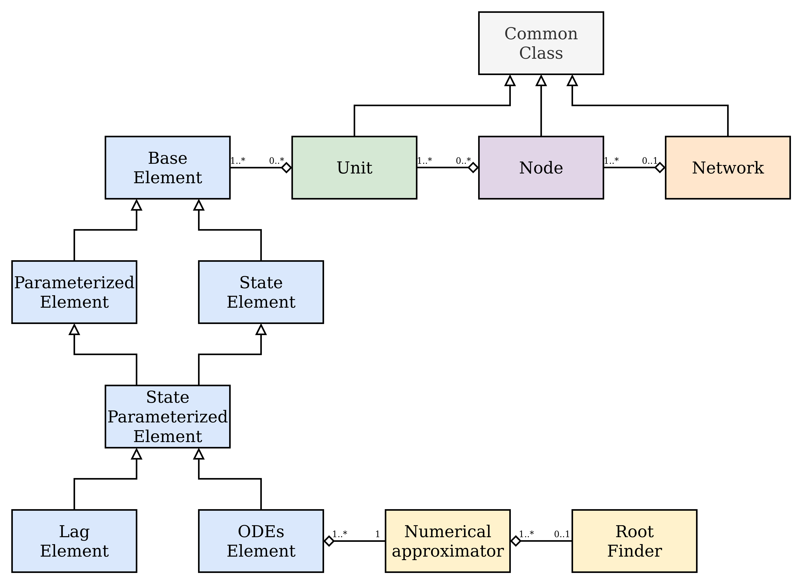

.. note:: Last update 20/07/2021

.. .. warning:: This guide is still work in progress. New pages are being written
..              and existing ones modified. Once the guide will reach its final
..              version, this box will disappear.

Reference
=========

This reference provides details of the classes within SuperflexPy. This page is
limited to the core framework (i.e. content of :code:`superflexpy/framework/`
and :code:`superflexpy/utils/`), in order to provide a clear reference for the
classes that should be customized to extend SuperflexPy. Particular
implementations of  components (i.e. the content of
:code:`superflexpy/implementation/`) are not included.

The following diagram follows the standards of
`UML <https://en.wikipedia.org/wiki/Class_diagram>`_ and shows the organization
of the classes composing the framework. All the classes in the diagram can be
extended through inheritance to create customized components.

superflexpy.framework.element
-----------------------------

.. autoclass:: superflexpy.framework.element.BaseElement
    :members:
    :undoc-members:
    :private-members:
    :show-inheritance:
    :special-members: __init__

.. autoclass:: superflexpy.framework.element.ParameterizedElement
    :members:
    :undoc-members:
    :private-members:
    :special-members: __init__
    :show-inheritance:

.. autoclass:: superflexpy.framework.element.StateElement
    :members:
    :undoc-members:
    :private-members:
    :special-members: __init__
    :show-inheritance:

.. autoclass:: superflexpy.framework.element.StateParameterizedElement
    :members:
    :undoc-members:
    :private-members:
    :special-members: __init__
    :show-inheritance:

.. autoclass:: superflexpy.framework.element.ODEsElement
    :members:
    :undoc-members:
    :private-members:
    :special-members: __init__
    :show-inheritance:

.. autoclass:: superflexpy.framework.element.LagElement
    :members:
    :undoc-members:
    :private-members:
    :special-members: __init__
    :show-inheritance:

superflexpy.utils.generic_component
-----------------------------------

.. autoclass:: superflexpy.utils.generic_component.GenericComponent
    :members:
    :undoc-members:
    :private-members:
    :special-members: __init__
    :show-inheritance:

superflexpy.framework.unit
--------------------------

.. autoclass:: superflexpy.framework.unit.Unit
    :members:
    :undoc-members:
    :private-members:
    :special-members: __init__
    :show-inheritance:

superflexpy.framework.node
--------------------------

.. autoclass:: superflexpy.framework.node.Node
    :members:
    :undoc-members:
    :private-members:
    :special-members: __init__
    :show-inheritance:

superflexpy.framework.network
-----------------------------

.. autoclass:: superflexpy.framework.network.Network
    :members:
    :undoc-members:
    :private-members:
    :special-members: __init__
    :show-inheritance:

superflexpy.utils.root_finder
-----------------------------

.. autoclass:: superflexpy.utils.root_finder.RootFinder
    :members:
    :undoc-members:
    :private-members:
    :special-members: __init__
    :show-inheritance:

superflexpy.utils.numerical_approximator
----------------------------------------

.. autoclass:: superflexpy.utils.numerical_approximator.NumericalApproximator
    :members:
    :special-members: __init__
    :show-inheritance:
